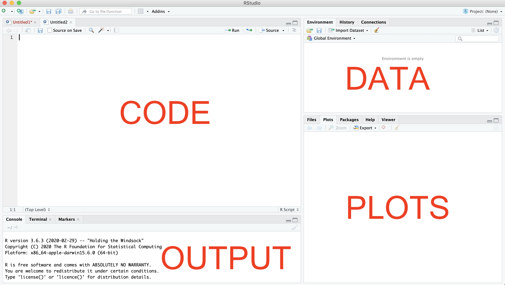

```{r setup, include=FALSE}
knitr::opts_chunk$set(echo = TRUE,
                      comment = NA)
knitr::knit_hooks$set(error = function(x, options) {
  paste0("<pre style=\"color: #B5271E;\"><code>", x, "</code></pre>")
})

```

```{css echo=FALSE}
.goog-tooltip {
    display: none !important;
}
.goog-tooltip:hover {
    display: none !important;
}
.goog-text-highlight {
    background-color: transparent !important;
    border: none !important; 
    box-shadow: none !important;
}

```

This page describes the steps needed to install 2 different programs on your computer - **R** and **RStudio**.

If you have already installed these, there is no need to read the rest.

If you do not, please follow the instructions below and famililarise yourself with the software.

Worksheet translations available

Disclaimer: may not be very accurate...

<div id="google_translate_element"></div>

<script>

function googleTranslateElementInit() {

new google.translate.TranslateElement({

pageLanguage: 'en'

}, 'google_translate_element');

}

</script>

<script src="//translate.google.com/translate_a/element.js?cb=googleTranslateElementInit">

</script>

# Installing R

## Windows
1. Go to [https://mirrors.nic.cz/R/bin/windows/base/R-4.2.1-win.exe](https://mirrors.nic.cz/R/bin/windows/base/R-4.2.1-win.exe) it will download a `.exe` file automatically

2. Open the downloaded file and follow the installation all the default settings should be fine, so you should simply have to keep clicking `next` until you reach the end of the installation

3. You now have R installed

**need help?** if you are not sure about these steps, see [https://www.testingdocs.com/install-r-on-windows-11/](https://www.testingdocs.com/install-r-on-windows-11/)

## Mac
1. Go to [https://mirrors.nic.cz/R/bin/macosx/base/R-4.2.1.pkg](https://mirrors.nic.cz/R/bin/macosx/base/R-4.2.1.pkg) it will download a `.pkg` file automatically

2. Open the downloaded file and follow the installation all the default settings should be fine, so you should simply have to keep clicking `next` until you reach the end of the installation

3. You now have R installed

**need help?** if you are not sure about these steps, see [https://biostatistics.letgen.org/mikes-biostatistics-book/appendix/install-r/#macScreens](https://biostatistics.letgen.org/mikes-biostatistics-book/appendix/install-r/#macScreens)

# Installing R Studio

## Windows
1. Go to [https://download1.rstudio.org/desktop/windows/RStudio-2022.07.2-576.exe](https://download1.rstudio.org/desktop/windows/RStudio-2022.07.2-576.exe) it will download a `.exe` file automatically

2. Open the downloaded file and follow the installation all the default settings should be fine, so you should simply have to keep clicking `next` until you reach the end of the installation

3. You now have RStudio installed

**need help?** if you are not sure about these steps, see [https://www.youtube.com/watch?v=Iws0JryD54g](https://www.youtube.com/watch?v=Iws0JryD54g)

## Mac
1. Go to [https://download1.rstudio.org/desktop/macos/RStudio-2022.07.2-576.dmg](https://download1.rstudio.org/desktop/macos/RStudio-2022.07.2-576.dmg) it will download a `.dmg` file automatically

2. Open the downloaded file and move the `RStudio` file to the `applications` folder (i.e. drag and drop it)

3. You now have RStudio installed

**need help?** if you are not sure about these steps, see [https://www.youtube.com/watch?v=L5rXTo-46bI](https://www.youtube.com/watch?v=L5rXTo-46bI)

# A quick tour of R:

- **What is R?** A programming language to do statistics (like a fancy calculator)
- **What is RStudio** A programme that makes it easy to use R
- **Why use it?** It is free and you can do lots more than just statistics with it (like making visualisations)
- **How do I R?** You write code, then look at things that are produced by your code
- **Is it hard to use?** It can be, but don't worry, we will go step-by-step, *\*\*you do not need to have any prior experience coding\*\**.

## R basics

We first we want to **open RStudio**, when it is open click `File > New file > R script`, this will open basically a blank file to write your code. You can see how RStudio structures things below.



In the `code` section, write the following and see what the output gives you (you can run the line by pressing `command + enter` on a Mac or `ctrl + enter` on Windows).

```{r eval=FALSE}
cat("Hello world!")
```

We want to do a bit more than just print words though, we first need to install a package that can make doing some fancy things easier. Run the following code (you can copy and paste or type it in the code section), this will install and load the [tidyverse](https://www.tidyverse.org) package:

```{r eval=FALSE}
install.packages("tidyverse")

library(tidyverse)

```

That is all for now, see you at the workshop!