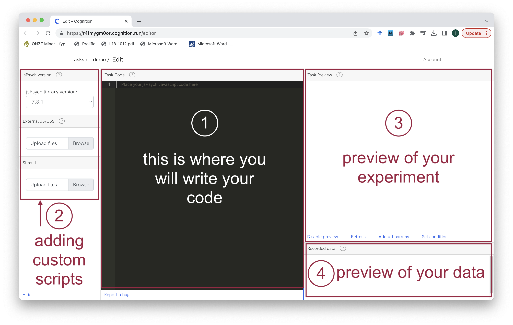

```{r echo=FALSE, warning=FALSE}
library(slickR)
library(htmltools)
library(xaringanExtra)
library(rmarkdown)
library(fontawesome)
library(bsplus)

```

```{r setup, warning=FALSE, echo=FALSE}
knitr::opts_chunk$set(echo = TRUE,
                      eval = FALSE,
                      comment = NA)

knitr::knit_hooks$set(
  message = function(x, options) {
     paste('<button type="button" class="collapsible1"><strong>',
     fa(name = "circle-info"),
     ' more info</strong></button>', '<div class="content1"><p>',
     gsub('##', '\n', x),
     '</p></div>',
     sep = '\n')
   })

codeblock = function(x, options) {
     cat(paste('<div class="codeblock">',
     paste0(x),
     '</div>',
     sep = '\n'))
   }

```

---

## `r fa("language")` Translations available

Disclaimer: may not be very accurate...

<div id="google_translate_element"></div>

---

# Worksheet overview

## `r fa("crosshairs")` Aims

By the end of this worksheet you should be able to:

- **program** your own experiments in jsPsych
- **host** the experiment online using cognition.run
- **use** the participant data for analysis
- **apply** the basic skills you have learnt for your own purposes
- **learn** some extra skills such as HTML, javascript, CSS and JSON

## `r fa("user-graduate")` Pre-requisites

To complete the aims you will need to:

- **follow** this worksheet
- **ask** questions if you are not sure/be able to google
- **have** a working computer and internet connection
- **be patient** when things do not work

You do not need to:

- have any **programming knowledge**
- have high **computer literacy**
- know anything about **jsPsych, cognition.run, html, css or javascript**
- be a **linguist**

## `r fa("folder-tree")` Structure

The worksheet will go through the following sections:

- Introducing cognition.run

    - creating an account
    - considerations when using it
    - familiarisation with the interface
<br/><br/>
- Introducing jsPsych

    - what it is
    - considerations when using it
    - using official documentation
<br/><br/>
- Running experiments

    - integrating JsPsych with cognition.run
    - familiarisation with JsPsych programming
    - building a very simple experiment

In the next sessions we will cover:

- building a proper experiment
- using stimuli files
- customising plugins
- customising appearance
- working with the data

---

# Introducing cognition.run and jsPsych

## cognition.run

**What is it?**

A free and easy way to host your jsPsych experiments.

**Why would I use it?**

If you do not have access to your own server, or do not want to pay for alternative online server options, this is a nice and simple solution for researchers.

**Do I have to spend lots of time learning how it works?**

Not really, once you learn how to use jsPsych the interface is really good for beginners to navigate and use.

**The free account will allow you to:**

- run your jsPsych experiments online
- code and preview your experiment
- access your data as a csv file
- collect a maximum of 80 participants per experiment
- learn the basics and complete this worksheet

**It will not be suitable if you:**

- need to collect a large amount of data from lots of participants
- collect data that would not be usable in csv format (e.g. audio recordings from participants)
- have stimuli that are very large in size (>2 MB, e.g. videos)
- are looking to host your experiments on your own server
- generally have more complex experimental designs


### Setting up an account

```{r echo=FALSE, eval=TRUE}
slickR(obj=c("images/cognition1.png","images/cognition2.png", "images/cognition3.png","images/cognition4.png", "images/cognition5.png", "images/cognition6.png"), width = "95%", height = 300)  + 
  settings(dots = TRUE, focusOnSelect = TRUE, customPaging = htmlwidgets::JS("function(slick,index) {
                            return '<a style=\"font-family:arial;color:#9F1F42;\">'+(index+1)+'</a>';
                       }"))

```


1. Go to [https://www.cognition.run/](https://www.cognition.run/) and click on the `create an account` button.<br/><br/>

2. Register for a free account by filling in the form.<br/><br/>

3. You will then see a dashboard, where you can see your experiments. Click on the `+ New task` button to create a new experiment.<br/><br/>

4. Where it says `task name` type the name **demo** (you can choose a different name if you want, but this is the name that we will use). If you click on the `Show advanced configuration` button to see additional settings, which may be relevant depending on your ethics application (e.g. data storage location, IP address logging). Click the `Save` button to create the experiment.<br/><br/>

5. Now you will see the experiment's dashboard. There are several options on this page which we will cover later, but for now we need to click on the `Source code` button.<br/><br/>

6. On this page you can start writing your code that makes your experiment. Before we start writing our code we will need to know how jsPsych works, which will be covered in the next section. We will return to the cognition.run interface too and see how to interact with it in more detail.<br/><br/>

```{r echo=FALSE, eval=TRUE, results='markup'}
message(x = paste("<b>Things might look different</b>",
              "The screenshots above might look different if you are reading this worksheet at a later date. This is because websites change, especially ones that are constantly developing, which also means the cost of using the service might also change.",
              sep = "<br/><br/>"))
```

---

## jsPsych

**What is it?**<br/>
A free and open source library that allows users to create and run experiments online. It relies on *javascript*, a programming language that most websites use, to implement *plugins* that can be used to make your experiments.

See:

[https://www.jspsych.org/](https://www.jspsych.org/)

de Leeuw, J. R. (2015). jsPsych: A JavaScript library for creating behavioral experiments in a web browser. *Behavior Research Methods*, 47(1), 1-12. [doi:10.3758/s13428-014-0458-y](https://doi.org/10.3758/s13428-014-0458-y).

**Why should I use it?**<br/>
It is an extremely adaptable and easy to use, with a growing community of users, support and contributors, making it more accessible for everybody to conduct research online. It is also free and open source.

**Do I have to spend lots of time learning how to use it?**<br/>
Probably. There is definitely a learning curve, which will take time to get around, but you learn lots of skills along the way. The more you learn, the more you can do. However, if you want to learn the basics you do not need too long to get a working experiment programmed and available to participants.

**Should I be worried if I do not know what javascript is?**<br/>
No. The great thing about jsPsych is that much of the hard work is already done by others, which means you can get by without worrying about the really complex stuff.

```{r echo=FALSE, eval=TRUE}
message(x = paste("<b>Versions of jsPsych</b>",
              "You might have noticed that jsPsych has different versions, e.g. 7.3.1, 6.3.0. This is somewhat confusing at first as you would hope that there would be no major differences in which version you are using, or that you would just choose the latest version. However, there are some important differences between the versions that can affect whether your script will work. These are largely based on whether you are using version 6.x.x or 7.x.x",
              "In this tutorial we will be using <b>version 7.3.1</b>",
              "You can see an outline of the differences at <a>https://www.jspsych.org/7.3/support/migration-v7/</a>",
              "Always try to write somewhere in your script which version of jsPsych you are working with.",
              sep = "<br/><br/>"))

```

---

# 1. Running experiments

In order to run your experiments, you have write code that will tell jsPsych what you want it to do. This requires you to speak the same way as jsPsych, so that your instructions can be interpreted properly.

Imagine you have to guide somebody from point A to point B on a map, you will have to learn how to give basic instructions like *turn left*, *stop*, *continue*, this is what your code will have to do (but in the context of a linguistics experiment, so more like *show this stimuli*, *collect this input*, *measure the time it takes to press this button*).

## Using cognition.run with jsPsych

To run your experiment, you will need somewhere to write your code. We will therefore return to `cognition.run`.

The image below outlines which parts of the interface can be used for different purposes. For now, we will **focus on 1 and 3** of the interface (writing code and previewing how it looks), with 3 and 4 being explained in more detail later.



## 0. Commenting your code

Before you start writing proper code that does things, it is important to remember that it is not just the computer who will interpret you write... you and other human brains need to as well.

To make it easier for humans, you can add **comments** to your code.

Comments don't do anything to your actual code, but add information to make it easier to understand and interpret. Imagine talking to somebody in a language that you both know, but there is somebody else in the group who does not speak that language, so you might offer a simplified translation to that person, so that they know what is happening. This is sort of similar to what comments do.

You can write a comment in the code section of the cognition.run interface in the following way:

```{js}
// This is a comment
```

These can be as long as you want, but must have `//` at the start of each new line.

Let's try writing a useful comment in our script, where we say:

- the title of the experiment
- what version of jsPsych we are using
- when we wrote the code [today]
- who is the author of the code [your name]

```{js}
// --------
// Title: My first experiment
// jsPsych version: 7.3.1
// date: [today]
// author: [your name]
//----------

```


## 1. Initiating jsPsych

Now we can start writing actual code that will allow us to use jsPsych properly.

In order for your experiment to work, the first line of code in your script should be:

```{js}
var jsPsych = initJsPsych();
```

Notice that this is not a comment and has a specific structure, or *syntax*, which is shown by the colour highlighting of the text. We can deconstruct this to understand each part of the code:<br/><br/>

- `var` this indicates that we want to create a *variable*, which we can use in our experiment.<br/>Notice that it is in a different colour to the rest of the text, this is because it is a *keyword* that javascript understands to be important, i.e. that you want to create a variable.<br/><br/>

- `jsPsych` this is the name of our variable, in theory you can name variables anything that you want.<br/><br/>
    
- `=` this is an *operator* it is used to assign a value to a variable, in this case whatever is on the right of the equals sign will be assigned to our jsPsych variable.<br/><br/>

- `initJsPsych()` this is a function specifically made for jsPsych experiments, it allows us to initiate an experiment, without this function we would not be able to do anything. Think of it as turning on the power button, nothing will happen until you have this function stored as a variable.<br/><br/>

- `;` this is a semi-colon, it is an important part of your code as it will allow the script to know that your specific bit of code (or statement) is finished and you can move on to your next one.<br/><br/>

```{r echo=FALSE, eval=TRUE}
message(x = paste("<b>What is a variable?</b><br/><br/>",
              "See [this](https://www.freecodecamp.org/news/javascript-variables-beginners-guide/) page for more information on what `var` means.<br/><br/>",
              "<b>Choosing a name for your variable</b><br/><br/>",
              "When naming your variable you should follow these rules:<br/><br/>",
              paste0(fa("circle-xmark", fill = "red"), " never include spaces (use_underscores_instead)<br/>"),
              paste0(fa("circle-xmark", fill = "red"), " never begin with a number<br/>"),
              paste0(fa("circle-xmark", fill = "red"), " never use a special javascript name (e.g. 'var' is not a good name for your variable)<br/><br/>"),
              paste0(fa("circle-check", fill = "green"), " always make them unique to other variables<br/>"),
              paste0(fa("circle-check", fill = "green"), " always make them memorable<br/>"),
              paste0(fa("circle-check", fill = "green"), " always be aware of upper and lower case ('myVariable' will be distinct from 'myvariable')<br/><br/>"),
              "<b>What goes inside the brackets?</b><br/><br/>",
              "When you see brackets for a function, there are normally some additional parameters that you can set, to see what these are you can always refer to the official [jsPsych documentation](https://www.jspsych.org/7.3/reference/jspsych/), for now we will keep our experiment to the default settings, so we do not need to add anything inside the brackets.<br/><br/>"
              ))

```

## 2. Experimental trials and plugins

Now we can actually make a trial to show to the participant.

Trials can be almost anything you can think of, all you need to do is convert your idea for an experiment into the suitable trials. This may take a bit more expertise for really complex experiments, but luckily JsPsych has already done a lot of the work and has a toolbox full of typical trials that you would normally need to run an experiment.

To do this we use `plugins`...

### Introducing plugins

Plugins are a key feature of JsPsych, they are outlined really nicely by the official JsPsych [page on plugins](https://www.jspsych.org/7.3/overview/plugins/), which is pasted below:

> In jsPsych, plugins define the kinds of trials or events that should occur during the experiment. Some plugins define very general events, like displaying a set of instructions pages, displaying an image and recording a keyboard response, or playing a sound file and recording a button response. Other plugins are more specific, like those that display particular kinds of stimuli (e.g., a circular visual search array), or run a specific version of particular kind of task (e.g., the Implicit Association Test). Part of creating an experiment with jsPsych involves figuring out which plugins are needed to create the tasks you want your participants to perform.<br/><br/>Plugins provide a structure for a particular trial or task, but often allow for significant customization and flexibility. For example, the image-keyboard-response plugin defines a simple structure for showing an image and collecting a keyboard response. You can specify the what the stimulus is, what keys the participant is allowed to press, how long the stimulus should be on the screen, how long the participant has to respond, and so on. Many of these options have reasonable default values; even though the image plugin has many different parameters, you only need to specify the image stimulus in order to use it. Each plugin has its own documentation page, which describes what the plugin does, what options are available, and what kind of data it collects.

If we look at the [JsPsych official documentation](https://www.jspsych.org/7.3/plugins/list-of-plugins/), we can see there are lots of plugins that we can choose to use.

The documentation page is really nicely written and has examples of each of the plugins, with sensible names so it should be relatively easy to choose the plugin that suits your needs.

We will work through a demo of one of these plugins to demonstrate how to implement them.

This Google Sheet can also be used as a quick reference point for the different plugins with descriptions of what they can be used for (note that all of the information in this file is taken from the official JsPsych plugin pages, it was simply compiled in this format by me):

https://docs.google.com/spreadsheets/d/11AqZu6KnCaneZmv4iFQ8JuakIShvvzJWqHU5gkcD3fw/edit?usp=sharing

### Plugin parameters

In order to use a plugin we need to set up a trial as a `var` so that we can use it in our experiment. This is done by using code that would look similar to this:

```{js}
var my_trial = {
  type: 'plugin_name',
  parameter1: something,
  parameter2: something_else
};
```

The structure of the code inside the {} is important, there will normally be a list of parameters which are predefined by the specific JsPsych plugin you are using, e.g. `type`, followed by a `:`, the information to the right of this is the information relevant to this specific parameter.

You will need to know what parameters to use and the corresponding information to provide in order to make the plugin work as intended.

Some are always likely to be used, e.g. the `type` parameter defines which plugin you want to use for your trial.

The best place to find this information is the JsPsych page for each of the plugins under the `parameters` section.

Below is the page for the `html-button-response` page:


### Plugin example

The first plugin we will use is essentially a button response. The participant will see a stimulus on the screen and a button underneath it. Once the button is pressed, the trial will end.

To do this we use the `html-button-response` - see the documentation page [here](https://www.jspsych.org/7.3/plugins/html-button-response/).

Below is the code used to create a single trial.

```{js}
var button_trial = {
  type: jsPsychHtmlButtonResponse,
  stimulus: 'Ahoj světe',
  choices: ['click me!'],
};

```

You can see it has the following structure:

`var`: we use var to declare that we are making a variable

`button_trial`: this is where we define the name for our variable, in this case we are calling it `button_trial`, remember to choose a sensible name for your trial

`=`: this denotes that everything on the right of the equals will be assigned to our button_trial variables

`{}`: this means we can assign multiple values to our variable, instead of just one. Everything inside the {} will be stored as information relevant to our variable.

`type:`:this is the standard way to identify which plugin you want to use for your trial, for any JsPsych trial that uses a specific plugin, you will have to use `type:` followed by the specific plugin name

`jsPsychHtmlButtonResponse`: this is the specific plugin name for a button response

`stimulus:`: this is the standard way to identify what your stimulus will be

`'Ahoj světe'`: this is our stimulus. It is a string/text stimuli, as denoted by the use of `'` around the text. Strings can contain letters, numbers or special characters e.g. 'Ahoj světe1!' will still work as a valid stimulus, see the more info box below for more information on invalid strings

`choices:`: this is the standard way to identify what your button will say

`['click me!']`: this is what the button says in our trial. We again use a text/string for the button label. Note we also use `[]` around the string, this is because a button response trial can take multiple strings, so if you add another string inside the [], e.g. `['click me!', 'do not click me!']`, will give you two buttons

You can see from the parameters documentation that there are a lot more parameters that you can use for this plugin, whereas the example code we have written above is quite simple, but it still works. We will cover more complex trials later.

```{r echo=FALSE, eval=TRUE}
message(x = paste("<b>Important differences between cognition.run and normal jsPsych experiments</b>",
              "Your experiment in cognition.run will look a but different from other JsPsysch experiments, e.g. the ones you might see that were hosted on private servers. This is because cognition.run does some things automatically, so you do not need to worry about adding specific code.",
              "One of the main differences is that all of the standard JsPsych plugins are automatically loaded for you. We will discuss this later in the worksheet, but if you have used JsPsych before, or are copying code from a non cognition.run experiment you might need to be aware of this.",
              "Essentially, the code you have in your cognition.run experiment will all be javascript, whereas a typical JsPsych experiment will be a html file, with the javascript embedded within that file.",
              sep = "<br/><br/>"))

```

## 3. Timelines

For our experiment to work we need to add a `timeline`. We use these to store each of the **trials** of our experiment, e.g. informed consent, instructions, practice trials, experimental trials, ending message.

The `timeline` is simply the place where we store all of the trials, ensuring that they will be presented to the participant in a specific order.

**We would normally create a `timeline` before making the trials**, but it seemed logical to introduce plugins first for this worksheet.

This can be done by creating a `var` called `timeline` and then the thing that this variable will store is an **empty array**, which is denoted by the `[]`.

Once we have set up the timeline, then we can make the trials and **push** them into the timeline array. So our timeline would eventually look like [informed consent, instructions, practice trials, experimental trials, ending message].

```{js }
var timeline = [];
```

Now we have a timeline and a trial, we can **push** the trial into our timeline, so that when we run the experiment, the trial is part of the timeline.

We do this in the following way:

```{js}
timeline.push(button_trial);
```

By doing this, our timeline will now look like this: `[button_trial]`, which would be the same as writing `var timeline = [button_trial]`. Normally we would be having many trials in our timeline, so using `push` is a quick and easy way to test and debug specific trials in your timeline.

```{r echo=FALSE, eval=TRUE}
message(x = paste("<b>Does it have to be called timeline?</b>",
              "No, you can call your timeline anything you want when declaring it as a var.",
              "It is important that you know what your timeline will be called though, as this will change the code when you push your trial",
              "e.g. if you define a timeline called my_timeline, then to push your trial to this array, you will need to use my_timeline.push(button_trial)",
              sep = "<br/><br/>"))

```

## 4. Running your experiment

You might have noticed in the preview box in cognition.run that you have not seen your experiment yet. This is because there is one last important piece of code that we need in order to let JsPsych know that we are ready to run our timeline.

This is:

```{js}
jsPsych.run(timeline);
```

You can see here that we use the `jsPsych` as our first function, then the `.run` part lets JsPsych know that we want to start the experiment. Inside the `()` we write the name of our timeline.

## 5. The full example code

You should now have in your code section your complete code to run a very basic experiment.

This should include:

- Initiating JsPsych
- Using a plugin to make a trial
- Creating a timeline and pushing your trial to the timeline
- Running your timeline

Here is an example of code that should work, if you want to copy and paste it:

```{r echo=FALSE, eval=TRUE, out.width="90%"}
knitr::include_url("code_examples/Untitled1.html")

```

This is how it should look in cognition.run:


```{r echo=FALSE, eval=TRUE, warning=FALSE}
htmltools::tags$script(src = "js/translate.js")
# htmltools::tags$script(src = "js/infobox.js")
htmltools::tags$script(src="//translate.google.com/translate_a/element.js?cb=googleTranslateElementInit")

htmltools::tagList(
  xaringanExtra::use_clipboard(
    button_text = "<i class=\"fa fa-clipboard\" style=\"font-size: 25px\"></i>",
    success_text = "<i class=\"fa fa-check\" style=\"color: #90BE6D; font-size: 25px\"></i>",
  ),
  rmarkdown::html_dependency_font_awesome()
)

```

```{js echo=FALSE, eval=TRUE}
var coll = document.getElementsByClassName("collapsible1");
var i;

for (i = 0; i < coll.length; i++) {
  coll[i].addEventListener("click", function() {
    this.classList.toggle("active1");
    var content = this.nextElementSibling;
    if (content.style.maxHeight){
      content.style.maxHeight = null;
    } else {
      content.style.maxHeight = content.scrollHeight + "px";
    }
  });
}

```
