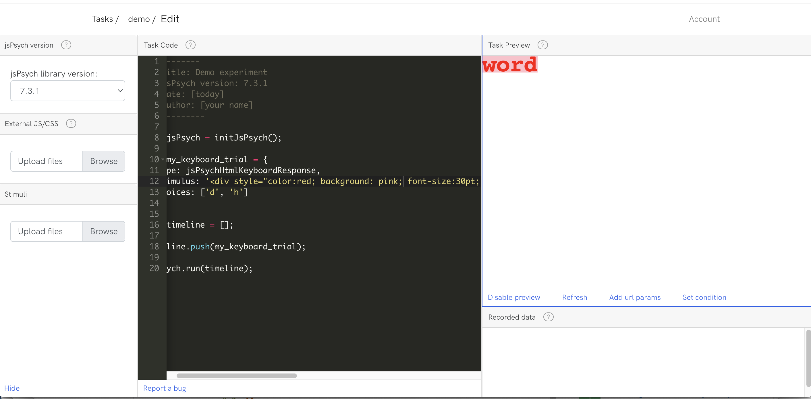
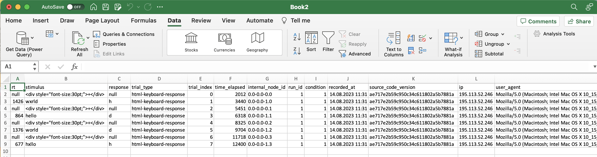
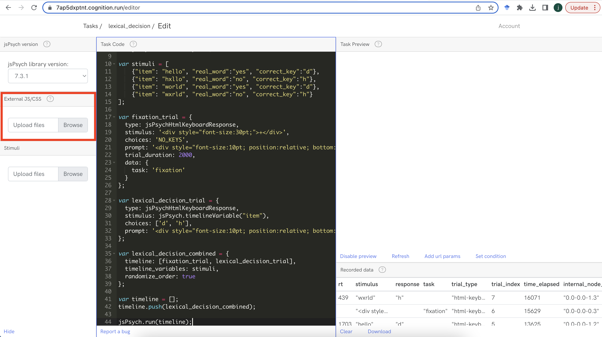

```{r echo=FALSE, warning=FALSE}
library(slickR)
library(htmltools)
library(xaringanExtra)
library(rmarkdown)
library(fontawesome)
library(bsplus)

```

```{r setup, warning=FALSE, echo=FALSE}
knitr::opts_chunk$set(echo = TRUE,
                      eval = FALSE,
                      comment = NA,
                      message = FALSE,
                      warning = FALSE)

knitr::knit_hooks$set(
  message = function(x, options) {
     paste('<button type="button" class="collapsible1"><strong>',
     fa(name = "circle-info"),
     ' more info</strong></button>', '<div class="content1"><p>',
     gsub('##', '\n', x),
     '</p></div>',
     sep = '\n')
   })

codeblock = function(x, options) {
     cat(paste('<div class="codeblock">',
     paste0(x),
     '</div>',
     sep = '\n'))
   }

```

---

## `r fa("language")` Translations available

Disclaimer: may not be very accurate...

<div id="google_translate_element"></div>

---

# Worksheet overview

## `r fa("crosshairs")` Aims

By the end of this worksheet you should be able to:

- **program** your own experiments in jsPsych
- **host** the experiment online using cognition.run
- **use** the participant data for analysis
- **apply** the basic skills you have learnt for your own purposes
- **learn** some extra skills such as HTML, javascript, CSS and JSON

## `r fa("user-graduate")` Pre-requisites

To complete the aims you will need to:

- **follow** this worksheet
- **ask** questions if you are not sure/be able to google
- **have** a working computer and internet connection
- **be patient** when things do not work

You do not need to:

- have any **programming knowledge**
- have high **computer literacy**
- know anything about **jsPsych, cognition.run, html, css or javascript**
- be a **linguist**

## `r fa("folder-tree")` Structure

The worksheet will go through the following sections:

- Building a lexical decision experiment

    - using a keyboard response plugin
    - customising the stimuli with CSS
    - customising the plugin parameters
    - combining trials into a timeline
<br/><br/>
- Timeline variables

    - how to use them
    - adding variables to your results data
    - 
<br/><br/>
- Working with stimuli files

    - starting with csv files
    - using R to convert to JSON
    - uploading to cognition.run

<!-- ## `r fa("arrow-right")` Up next -->

<!-- In the next sessions we will cover: -->

<!-- - building a proper experiment -->
<!-- - using stimuli files -->
<!-- - customising plugins -->
<!-- - customising appearance -->
<!-- - working with the data -->

## `r fa("lightbulb")` Recap

In the last session we should have:

- set up an account for cognition.run
- become familiar with the cognition.run interface
- become familiar with JsPsych
- learnt what a plugin is and how they work
- built a very simple experiment

---

# Building a lexical decision experiment

One of the most common measurements collected in experiments are reaction times (rt). In this section we will be using a keyboard response plugin, i.e. where the participant presses a specific key on their keyboard in response to a stimuli in order to measure how long it takes the participant to respond.

The paradigm that we will use to practice using this plugin will be the **lexical decision task**, where a word or non-word will be presented on the screen and the participant has to respond to the stimuli with one of two key options, they will press `key1` if they think the word is real, `key2` if they think the word is not real.

## the html-keyboard-response plugin

The basic structure of the `html-keyboard-response` plugin is:

```{js}
var my_keyboard_trial = {
  type: jsPsychHtmlKeyboardResponse,
  stimulus: 'my_stimulus',
  choices: ['key1', 'key2', 'key_n']
};

```

If we used this in a full experiment in cognition.run, we would just see `my_stimulus` on the screen and it would just wait for a valid keyboard response from the participant.

- The `type` parameter declares which plugin to use, here we are using the `jsPsychHtmlKeyboardResponse` plugin

- The `stimulus` parameter declares what stimulus to present, here we just use the string `'my_stimulus'`

- The `choices` parameter declares which keys are valid for the trial, here we use an array, as shown by the `[` and `]` at the start and end. The strings `'key1'`, `'key2'` and `'key_n'` are not actually valid keys and would not be recognised by jspsych, they are just for generalisation. Instead, we would probably use something like `['a', 'b', 'c']` if we wanted to allow responses only from the keys `a`, `b` and `c`.<br/><br/>**Note**<br/>If you want to allow **all possible keys**, we would use `choices: 'ALL_KEYS'`.<br/><br/>If you want to **prevent all keys** from being allowed, we would use `choices: 'NO_KEYS'`.<br/><br/>If you are unsure how to specify the key you want, refer to https://docs.google.com/spreadsheets/d/19v9OGreNGmmOAacJ33cSrouNO_OfBxqa4hiXTwex5dY/edit?usp=sharing

For this tutorial, we will make the following trial as the basis for our lexical decision experiment:

```{js}
var my_keyboard_trial = {
  type: jsPsychHtmlKeyboardResponse,
  stimulus: 'word',
  choices: ['d', 'h']
};

```

We now have the stimulus as `word` and the choices as `d` or `h`.

Remember, that if we want to preview all of our experiment in cognition.run, we need to have a fully working jspsych code, so the full code we would need is:

```{js}
// --------
// Title: lexical decision experiment
// jsPsych version: 7.3.1
// date: [today]
// author: [your name]
//----------

var jsPsych = initJsPsych();

var my_keyboard_trial = {
  type: jsPsychHtmlKeyboardResponse,
  stimulus: 'word',
  choices: ['d', 'h']
};

var timeline = [];

timeline.push(my_keyboard_trial);

jsPsych.run(timeline);

```

This is what it should look like in cognition.run:


## customising the stimulus with CSS

Our stimulus may not look how we want it to look, e.g. the font, colour, size etc might not be the preferred style for our experiment.

This is because jspsych has certain default values for the appearance of things like text. But, it can easily be modified with some extra code.

This is based on CSS (Cascading Style Sheets), which allows html to be styled in a specific way. We will cover CSS in more detail later, but it is quite a large topic and is a separate language to html and javascript, so it is not within the scope of this level of tutorial to cover it thoroughly now.

What we will do is apply some basic CSS styling to our stimulus, to demonstrate how to customise some aspects of the appearance. Crucially, this can be done within some basic html code. This keeps things simple.

Currently, our stimulus is `'word'`, which is presented with the following defaults:

- font-family: Arial;
- font-size: 18px;
- color: black;
- font-weight: normal;

If we want to change any of this, or indeed anything else about the appearance, we need to add some inline css to the stimulus.

We can do this by modifying the stimulus to look more like html with css:

```{js}
stimulus: '<div>word</div>

```

You will see the added `<div>` and `</div>` at the start and end of the word.

This is html.

It identifies the text as a `content division element`. Note that there is `<div>` at the start to indicate the start of the content and a `</div>` a the end to indicate the end of the content. Nothing really changes at the moment as jspsych already defines the text in this way by default.

However, what we can now do is add css to our div. We do this in the following way:

```{js}
stimulus: '<div style="color:red;">word</div>

```

Now we have added some css to our html object. This is done by the `style="color:red"` part.

When adding css directly to html in this way, we first have to declare that we want to style the specific element, in this example the text contained in our `div`. Therefore it goes within the starting `<div>`.

It is evaluated as css by the `style` function, with different elements of the styling being declared within the `" "` after the `=`.

In the above example, we change the css of the text `color` to `red`. Note the `;` which we use to indicate the end of the color parameter changes.

We can now use this basic structure to change other parameters related to the styling of the text in our div element.

```{js}
stimulus: '<div style="color:red; background: pink; font-size: 30pt; font-family: monospace; font-weight: bold; position: absolute; top: 0px; left: 0;">word</div>

```

Now we have the following parameters declared:

- `colour: red` makes the text color red, you can use [color names](https://htmlcolorcodes.com/color-names/) or [hex codes](https://htmlcolorcodes.com/color-picker/) e.g. #00000 is black
- `background: pink` makes the text background pink, again you can use color names or hex codes
- `font-size: 30pt` makes the text size 30 point, you can also specify other [units](https://www.digitalocean.com/community/tutorials/css-css-units-explained)
- `font-family: monospace` makes the font monospace, other [web safe fonts](https://www.w3schools.com/cssref/css_websafe_fonts.php) can be used
- `font-weight: bold` makes the font bold, other [weights](https://developer.mozilla.org/en-US/docs/Web/CSS/font-weight) can be used
- `position: absolute` makes the positioning of the text absolute in relation to the screen, it needs additional parameters to be specified such as top, right, bottom or left
- `top: 0px` makes the absolute positioning to be 0px from the top
- `left: 0px` makes the absolute positioning to be 0px from the left

This is what it should like:



## customising the plugin parameters

As we do not really need much styling to our stimuli, we will return to the original defaults of:

```{js}
var my_keyboard_trial = {
  type: jsPsychHtmlKeyboardResponse,
  stimulus: 'word',
  choices: ['d', 'h']
};

```

However, what we can do is change specific parameters of our trial.

If we refer to the plugin documentation on the jspsych website - https://www.jspsych.org/7.0/plugins/html-keyboard-response/ we can see that there are many other parameters that we can modify with this plugin.

### prompt

We might for example want to include a `prompt` if the trials are practice trials, so the participant can be reminded of which keys to press:

```{js}
var my_keyboard_trial = {
  type: jsPsychHtmlKeyboardResponse,
  stimulus: 'word',
  choices: ['d', 'h'],
  prompt: 'press "d" if you think it is a real word, press "h" if you think it is not a real word'
};

```

As you can see, the prompt is displayed in a quite inconvenient position. So we can now modify this using the html and css code we used previously:

```{js}
var my_keyboard_trial = {
  type: jsPsychHtmlKeyboardResponse,
  stimulus: 'word',
  choices: ['d', 'h'],
  prompt: '<div style="font-size:10pt; position:relative; bottom:150px;">press "d" if you think it is a real word, press "h" if you think it is not a real word</div>'
};

```

Now, we have changed the font size to `10pt` so it is smaller than the stimulus text.

We have also change the `position`, this time using `position:relative; bottom:150px`, unlike in the previous example where we used `position:absolute`, the use of `relative` means we move relative to where it was originally placed, so in this example we move it `150px` from the `bottom`, i.e. 150px vertically upwards from the bottom.

This is how it should now look:


### stimulus_duration

We might also want to only show the stimulus on the screen for a specified amount of time. To do this, we can add the `stimulus_duration` parameter:

```{js}
var my_keyboard_trial = {
  type: jsPsychHtmlKeyboardResponse,
  stimulus: 'word',
  choices: ['d', 'h'],
  prompt: '<div style="font-size:10pt; position:relative; bottom:150px;">press "d" if you think it is a real word, press "h" if you think it is not a real word</div>',
  stimulus_duration: 500
};

```

In the example above, we have set this parameter to `500`, which means that the stimulus will be shown only for 500ms. Note that the trial does not finish until a response has been made.

### trial_duration

If we want to make the trial end after a specified time, we can also add the `trial_duration` parameter:

```{js}
var my_keyboard_trial = {
  type: jsPsychHtmlKeyboardResponse,
  stimulus: 'word',
  choices: ['d', 'h'],
  prompt: '<div style="font-size:10pt; position:relative; bottom:150px;">press "d" if you think it is a real word, press "h" if you think it is not a real word</div>',
  stimulus_duration: 500,
  trial_duration: 1000
};

```

Now, the trial will end after `1000ms` or if there is a response by the participant in within the specified time.

This is how it should look:


## combining trials into a timeline

At the moment our experiment comprises of just one trial..., which is not particularly useful. However, what we have covered so far should allow us to put together the building blocks of an experiment.

In this section we will combine multiple trials into a timeline that is nested within our main timeline.

This will involve adding a new variable that has a `fixation trial`, so that our lexical decision trial is preceeded by this fixation trial.

Lets first make the lexical decision trial, we will keep it as just a keyboard response with no duration parameters:

```{js}
var lexical_decision_trial = {
  type: jsPsychHtmlKeyboardResponse,
  stimulus: 'word',
  choices: ['d', 'h'],
  prompt: '<div style="font-size:10pt; position:relative; bottom:150px;">press "d" if you think it is a real word, press "h" if you think it is not a real word</div>'
};

```

Now we will make the fixation trial, which will show a `+` stimulus on the screen for a set amount of time, in this case `2000ms`.

Note the `font-size` is set to 30pt and the choices is `NO_KEYS`, this mean we will just see the `+` on the screen and there will be no keys that end the trial, just the time limit of `2000ms`:

```{js}
var fixation_trial = {
  type: jsPsychHtmlKeyboardResponse,
  stimulus: '<div style="font-size:30pt;">+</div>',
  choices: 'NO_KEYS',
  prompt: '<div style="font-size:10pt; position:relative; bottom:150px;"><br/></div>',
  trial_duration: 2000
};

```

We can now make a new variable called `lexical_decision_combined`, this will combine the `fixation_trial` and the `lexical_decision_trial` in a specified order, within a specified timeline.

We do this using the `timeline` parameter, which we can specify within a standard `var`.

We assign the timeline an array, `[fixation_trial, lexical_decision_trial]`, which means that the timeline will first show the `fixation_trial`, then the `lexical_decision_trial`. If we changed the positions of the items in the array this will change the order of the presentation.

```{js}
var lexical_decision_combined = {
  timeline: [fixation_trial, lexical_decision_trial]
};

```

If we now push `lexical_decision_combined` to our timeline, using the `timeline.push`, we should see that it presents the two trials together.

This is how your code should look so far:

```{js}
// --------
// Title: Demo experiment
// jsPsych version: 7.3.1
// date: [today]
// author: [your name]
//----------

var jsPsych = initJsPsych();

var fixation_trial = {
  type: jsPsychHtmlKeyboardResponse,
  stimulus: '<div style="font-size:30pt;">+</div>',
  choices: 'NO_KEYS',
  prompt: '<div style="font-size:10pt; position:relative; bottom:150px;"><br/></div>',
  trial_duration: 2000
};

var lexical_decision_trial = {
  type: jsPsychHtmlKeyboardResponse,
  stimulus: 'word',
  choices: ['d', 'h'],
  prompt: '<div style="font-size:10pt; position:relative; bottom:150px;">press "d" if you think it is a real word, press "h" if you think it is not a real word</div>'
};

var lexical_decision_combined = {
  timeline: [fixation_trial, lexical_decision_trial]
};

var timeline = [];
timeline.push(lexical_decision_combined);

jsPsych.run(timeline);

```


# Timeline variables

The experiment is not really an experiment so far, it presents just one word...

So what we will focus on now is using larger stimuli sets, and using them within our timeline.

This means we can iterate through a list of stimuli, presenting them to the participant and collecting their responses during each trial.

## introducing JSON

An important thing to note about jspsych is that you can not just give it a csv or excel formatted file containing your stimuli. Instead, jspsych and javascript more generally, prefers to use JSON formatted files.

So an important concept to learn is how to work with this type of file.

Here is a framework example of what JSON formatted data looks like:

```{js}
var stimuli = [
    {"variable_name1": "first_item", "variable_name2":"1"},
    {"variable_name1": "second_item", "variable_name2":"2"},
    {"variable_name1": "third_item", "variable_name2":"3"},
    {"variable_name1": "fourth_item", "variable_name2":"4"}
];

```

As a csv or excel file this would look like this:

```{r warning=FALSE, echo=FALSE, eval=TRUE}
# library(tidyverse)
library(DT)

```

```{r echo=FALSE, eval=TRUE, warning=FALSE}
datatable(data.frame(variable_name1 = c("first_item", "second_item", "third_item", "fourth_item"),
                 variable_name2 = c(1, 2, 3, 4)), rownames = FALSE, filter = "none", autoHideNavigation = TRUE, options = list(dom = 't'))

```

In the `stimuli` variable above, we have a very specific way of coding the data:

- everything is stored in an `array`, i.e. we use `[` and `]` around the information, this will allow jspsych to understand everything in a way similar to each item in the array being like a row in a csv or excel file

- each `item` in the array is enclosed in `{` and `}`, the information within each of these items is essentially like a row of data. Each item is separated by a `,`

- the structure of the items is `"variable_name1":"value"`, which means the variable name is specified as a string, i.e. `" "` followed by a `:`, with the corresponding value following, also normally specified as a string. The next variable follows the same structure, with new variables separated by a `,`

- in order for jspsych to read the information in a JSON formatted object, we need to assign it as a `var`, e.g. `var stimuli = `

## introducing timeline variables

As mentioned before, we probably want our experiment to iterate through a list of stimuli, presenting those stimuli within a timeline.

To do this, we can use the `timeline_variables` parameter. This is normally done in a var that contains a timeline, e.g. like the `lexical_decision_combined` var we made previously.

First lets make some example stimuli suitable for a lexical decision task:

```{js}
var stimuli = [
    {"item": "hello", "real_word":"yes", "correct_key":"d"},
    {"item": "hxllo", "real_word":"no", "correct_key":"h"},
    {"item": "world", "real_word":"yes", "correct_key":"d"},
    {"item": "wxrld", "real_word":"no", "correct_key":"h"}
];

```

Here the stimuli have three variables:

- `item` the stimuli to be presented during the trial
- `real_word` whether the word is considered to be real or not
- `correct_key` the key the expect the participant to respond with, where `d` is a real word and `h` is a non-word

Now we can use this var for our `timeline_variables` parameter:

```{js}
var lexical_decision_combined = {
  timeline: [fixation_trial, lexical_decision_trial],
  timeline_variables: stimuli
};

```

The next step is to update the `stimuli` parameter in the `lexical_decision_trial` var:

```{js}
var lexical_decision_trial = {
  type: jsPsychHtmlKeyboardResponse,
  stimulus: jsPsych.timelineVariable("item"),
  choices: ['d', 'h'],
  prompt: '<div style="font-size:10pt; position:relative; bottom:150px;">press "d" if you think it is a real word, press "h" if you think it is not a real word</div>'
};

```

One thing you might have noticed is that the stimuli are presented in the same order as they are specified in the `stimuli` this is because if we want the presentation order to be randomised, we need to add an extra parameter to our `lexical_decision_combined` var. This is `randomize_order`, which we can set to `true`:

```{js}
var lexical_decision_combined = {
  timeline: [fixation_trial, lexical_decision_trial],
  timeline_variables: stimuli,
  randomize_order: true
};

```

Now we have a randomised version of our lexical decision experiment, using the stimuli stored in the `stimuli` var, where we iterate through the stimuli, presenting a fixation and then the lexical decision trial.

This is what it should look like:


# Understanding the results

## inspecting the data

Now we have a working lexical decision experiment, it might be worth looking at the results.

We can do this in cognition.run by looking at the **bottom right box**:


As you complete trials in the experiment, it will add a new row of data to this section. So every time you advance in the experiment, the data is stored automatically.

It is easy to have a quick look at the data using this box, but you can also `download` it as a csv file using the `download` button. Which should give you a file called `demo_preview.csv`.

If you open this in excel or R you should see something like this:



There should be 18 columns and 8 rows of data, we can quickly inspect what these are:

The key variables to consider are:

- `rt` this is the reaction time measured in ms
- `stimulus` this is the stimulus shown to the participant, including any html
- `response` this is the recorded value for the trial, in this example it will be the key pressed
- `trial_type` this is the plugin used
- `trial_index` this is the trial number, it increases sequentially after each trial
- `time_elapsed` this is the duration of the experiment, recorded at the end of each trial, it is cumulative

All the other variables are quite technical:
- `internal_node_id` this is a way to distinguish between different parts of the experiment
- `run_id` this is the id of the individual attempt at the experiment
- `condition` this is the condition assigned to the participant
- `recorded_at` this is the date and time of the recorded data
- `source_code_version` this is probably something related to cognition.run
- `ip` this is the ip address of the participant
- `user_agent` this contains the details of the browser being used by the participant
- `device` this is the make of the computer being used by the participant
- `browser` this is the browser being used by the participant
- `browser_version` this is the version of the browser being used by the participant
- `platform` this is the operating system being used by the participant
- `platform_version` this is the version of the operating system being used by the participant

If we look at the `rt` column, we can see that there are values for our lexical decision trials. In the `stimulus` column we can see which item was being responded to, e.g. `světe` had a rt of `571` in the above screenshot.

Note that data for the fixation trials will also be stored as a row, even though we might not actually need it for analysis.

## adding variables to our results

What would be helpful however, is to add new columns to our data, such as the additional ones in our `stimuli` var.

To do this, we need to add some extra parameters to our `lexical_decision_trial` var, specifically a `data` parameter:

```{js}
var lexical_decision_trial = {
  type: jsPsychHtmlKeyboardResponse,
  stimulus: jsPsych.timelineVariable("item"),
  choices: ['d', 'h'],
  prompt: '<div style="font-size:10pt; position:relative; bottom:150px;">press "d" if you think it is a real word, press "h" if you think it is not a real word</div>',
  data: {
    task: 'lexical_decision',
    real_word: jsPsych.timelineVariable('real_word'),
    correct_key: jsPsych.timelineVariable('correct_key')
    }
};

```

The format of this parameter takes an object format, so the information needs to have `{` and `}` around the information.

Now we can define the variables to be stored in the data:

- `task` will store just a string of `lexical_decision` for all of these trials
- `real_word` will store the value in our timeline variable relating to the `real_word` variable, so in this example it will be either `yes` or `no`
- `correct_key` will again store the value in our timeline variable, but for the `correct_key` variable, so in this example either `d` or `h`

The names of the variables in our data object can be anything you choose, assuming they are valid names, i.e. no spaces etc. if you are wanting to store something from the timeline_variables var, you must use `jsPsych.timlineVariable()` with the name of the specific variable you want to refer to inside the brackets, written as a string, e.g. `'real_word'`.

Now lets add some data to our fixation trial too, so we can distinguish it from the lexical decision trial in the `task` variable:

```{js}
var fixation_trial = {
  type: jsPsychHtmlKeyboardResponse,
  stimulus: '<div style="font-size:30pt;">+</div>',
  choices: 'NO_KEYS',
  prompt: '<div style="font-size:10pt; position:relative; bottom:150px;"><br/></div>',
  trial_duration: 2000,
  data: {
    task: 'fixation'
  }
};

```

Now if we complete the experiment and look at the data, we should see (note: I have removed some columns for ease of reading the screenshot, the new variables stored in the data will be at the right of the csv after `platform_version`):


The full code should be:

```{js}
// --------
// Title: Demo experiment
// jsPsych version: 7.3.1
// date: [today]
// author: [your name]
//----------

var jsPsych = initJsPsych();

var stimuli = [
    {"item": "hello", "real_word":"yes", "correct_key":"d"},
    {"item": "hxllo", "real_word":"no", "correct_key":"h"},
    {"item": "world", "real_word":"yes", "correct_key":"d"},
    {"item": "wxrld", "real_word":"no", "correct_key":"h"}
];

var fixation_trial = {
  type: jsPsychHtmlKeyboardResponse,
  stimulus: '<div style="font-size:30pt;">+</div>',
  choices: 'NO_KEYS',
  prompt: '<div style="font-size:10pt; position:relative; bottom:150px;"><br/></div>',
  trial_duration: 2000,
  data: {
    task: 'fixation'
  }
};

var lexical_decision_trial = {
  type: jsPsychHtmlKeyboardResponse,
  stimulus: jsPsych.timelineVariable("item"),
  choices: ['d', 'h'],
  prompt: '<div style="font-size:10pt; position:relative; bottom:150px;">press "d" if you think it is a real word, press "h" if you think it is not a real word</div>'
};

var lexical_decision_combined = {
  timeline: [fixation_trial, lexical_decision_trial],
  timeline_variables: stimuli,
  randomize_order: true
};

var timeline = [];
timeline.push(lexical_decision_combined);

jsPsych.run(timeline);

```

# Formatting files from csv to javascript/JSON in R

One annoying thing about all this, is the idea of having to reformat all your stimuli to a javascript variable in JSON format, which may be an unfamiliar format and most researchers use excel or R to prepare their stimuli files in csv format.

There is a solution to this problem by using R!

There is a great package called `jsonlite` which is really useful for working with data in json format. This means we can easily format a csv file to json and save it as a javascript var with just a few lines of code.

You can read more about jsonlite [here](https://cran.r-project.org/web/packages/jsonlite/vignettes/json-aaquickstart.html).

So our workflow will be this:

1. create a stimuli file in the traditional way, e.g. using excel or other spreadsheet style software
2. export that file to .csv format
3. load in useful packages
4. load that file in to R
5. convert the R version of the data to JSON using the toJSON function
6. add some text to make it a javascript object
7. export that file to .js format
8. upload it as an `external JS/CSS file in cognition.run
9. use the var as a timeline variable

### 1. create a stimuli file

Open up a spreadsheet software and make your stimuli file.

In this worksheet we will continue with the lexical decision style stimuli, i.e. words and non-words.

There should be 3 columns: `item`, `real_word` and `correct_key`
There should be 20 rows: 10 of which are real words and the other 10 are non-words

The data should look like this:


### 2. export to csv

If you are working with your own file, export it as a .csv file, preferably with utf-8 encoding.

Alternatively, you can download the file
[here](lexical_decision_stimuli.csv), it should be saved as `lexical_decision_stimuli.csv`

### 3. load in packages

Open up RStudio or R on your computer and open a new R script.

You will need the `jsonlite` the `tidyverse` packages installed and loaded in to R.

If you have not got any of these installed, first run this code:

```{r eval=FALSE, echo=TRUE}
install.packages("jsonlite")
install.packages("tidyverse")

```

Once you have them installed, you should now load them in to R:

```{r eval=FALSE, echo=TRUE}
library(jsonlite)
library(tidyverse)

```

### 4. load in to R

We will need to load in the csv file in to R as an object. To do this, we need to tell R where the file is - the `working directory` or folder containing the file.

If you are not familiar with R, you can set the working directory by clicking on the options in this screenshot, then choose the folder where your csv file is saved:


Now store the file as an object called `lexical_decision_stimuli`.

```{r eval=FALSE, echo=TRUE}
lexical_decision_stimuli <- read_csv("lexical_decision_stimuli.csv")

```

### 5. convert to JSON

We will now be able to use the `toJSON` function.

We will assign the json version to an object called `lexical_decision_stimuli_JSON`.

The `toJSON` function takes as the first argument your data, so in this case `lexical_decision_stimuli`.

We use the additional argument `pretty=TRUE` to make the output look pretty and easy to read.

```{r eval=FALSE, echo=TRUE}
lexical_decision_stimuli_JSON <- toJSON(lexical_decision_stimuli, pretty=TRUE)

lexical_decision_stimuli_JSON

```

We now have JSON formatted data!

### 6. make into javascript var

You will see there is no `var` assignment in the `lexical_decision_stimuli_JSON` object, it is just text.

But we can add this information quite easily using the `paste0` function:

```{r eval=FALSE, echo=TRUE}
lexical_decision_stimuli_JSON <- paste0("var stimuli = ", lexical_decision_stimuli_JSON, ";")

lexical_decision_stimuli_JSON

```

We should now see that the start of the text has `var stimuli = `, followed by the JSON formatted data, and finally the text ends with a `;`.

### 7. export that file to javascript

Now we have the data formatted correctly, we can save the file using the `write_file` function, note that you should specify the exact file path of where you want the `file` to be saved:

```{r eval=FALSE, echo=TRUE}
write_file(x = lexical_decision_stimuli_JSON, file = "lexical_decision_stimuli_JSON.js")

```

You should now see the file in your working directory, importantly this is a `js` or javascript file.

You can download this file [here](lexical_decision_stimuli_JSON.js), in case you had problems with running the R code.

It should look like this:


Here is the full R code in a slightly more efficient way:

```{r eval=FALSE, echo=TRUE}
install.packages("jsonlite")
install.packages("tidyverse")

library(jsonlite)
library(tidyverse)

paste0("var stimuli = ",
       toJSON(read_csv("lexical_decision_stimuli.csv"),
              pretty=TRUE),
       ";") %>%
  write_file(file = "lexical_decision_stimuli_JSON.js")

```

### 8. upload that file to cognition.run

You will see in cognition.run that there is an option to upload `external JS/CSS`, this is how we will now upload our stimuli file to the experiment.



Click on the `browse` button and find the `lexical_decision_stimuli_JSON.js` file.

Once it has been uploaded, you should see it appear underneath the browse button.

### 9. using the stimuli as a timeline_variable

Notice that we probably still have the following code in our script:

```{js}
var stimuli = [
    {"item": "hello", "real_word":"yes", "correct_key":"d"},
    {"item": "hxllo", "real_word":"no", "correct_key":"h"},
    {"item": "world", "real_word":"yes", "correct_key":"d"},
    {"item": "wxrld", "real_word":"no", "correct_key":"h"}
];

```

This means that our new stimuli will be overwritten by this section of the code. This is because we named our new stimuli var `stimuli`.

To resolve this issue, and use our new stimuli, we need to **delete** the above code in our script.

This means our final code should be:

```{js}
// --------
// Title: Demo experiment
// jsPsych version: 7.3.1
// date: [today]
// author: [your name]
//----------

// inititate jspsych
var jsPsych = initJsPsych();

// make a fixation trial
var fixation_trial = {
  type: jsPsychHtmlKeyboardResponse,
  stimulus: '<div style="font-size:30pt;">+</div>',
  choices: 'NO_KEYS',
  prompt: '<div style="font-size:10pt; position:relative; bottom:150px;"><br/></div>',
  trial_duration: 2000,
  data: {
    task: 'fixation'
  }
};

// make a lexical decision trial
var lexical_decision_trial = {
  type: jsPsychHtmlKeyboardResponse,
  stimulus: jsPsych.timelineVariable("item"),
  choices: ['d', 'h'],
  prompt: '<div style="font-size:10pt; position:relative; bottom:150px;">press "d" if you think it is a real word, press "h" if you think it is not a real word</div>',
  data: {
    task: 'lexical_decision',
    real_word: jsPsych.timelineVariable('real_word'),
    correct_key: jsPsych.timelineVariable('correct_key')
    }
};

// make a variable which combines the fixation and lexical decision together
// use stimuli as timeline_variables and randomise the presentation order
var lexical_decision_combined = {
  timeline: [fixation_trial, lexical_decision_trial],
  timeline_variables: stimuli,
  randomize_order: true
};

// set up main timeline
var timeline = [];

// push the lexical_decision_combined variable to the timeline
timeline.push(lexical_decision_combined);

//run the experiment
jsPsych.run(timeline);


```


```{r echo=FALSE, eval=TRUE, warning=FALSE}
htmltools::tags$script(src = "js/translate.js")
# htmltools::tags$script(src = "js/infobox.js")
htmltools::tags$script(src="//translate.google.com/translate_a/element.js?cb=googleTranslateElementInit")

htmltools::tagList(
  xaringanExtra::use_clipboard(
    button_text = "<i class=\"fa fa-clipboard\" style=\"font-size: 25px\"></i>",
    success_text = "<i class=\"fa fa-check\" style=\"color: #90BE6D; font-size: 25px\"></i>",
  ),
  rmarkdown::html_dependency_font_awesome()
)

```

```{js echo=FALSE, eval=TRUE}
var coll = document.getElementsByClassName("collapsible1");
var i;

for (i = 0; i < coll.length; i++) {
  coll[i].addEventListener("click", function() {
    this.classList.toggle("active1");
    var content = this.nextElementSibling;
    if (content.style.maxHeight){
      content.style.maxHeight = null;
    } else {
      content.style.maxHeight = content.scrollHeight + "px";
    }
  });
}

```
