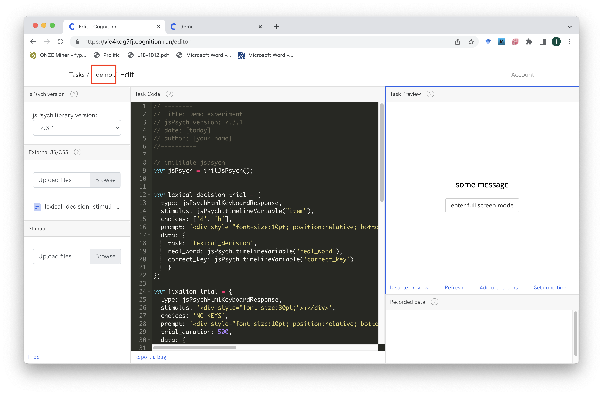
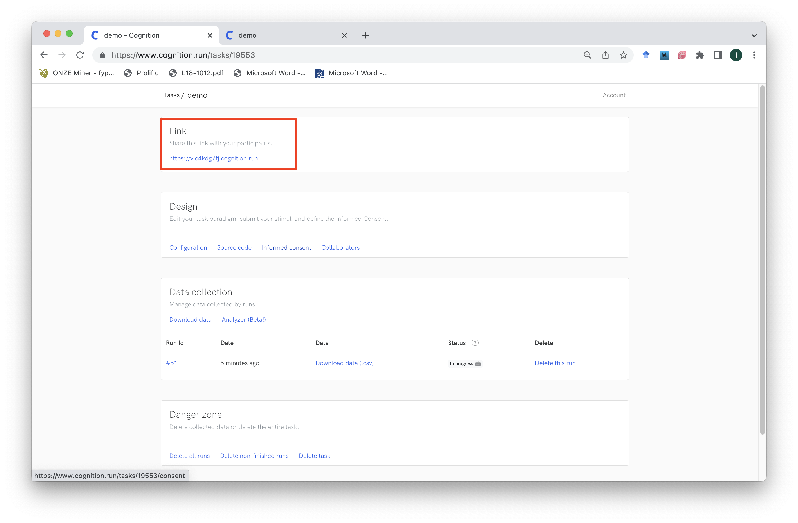
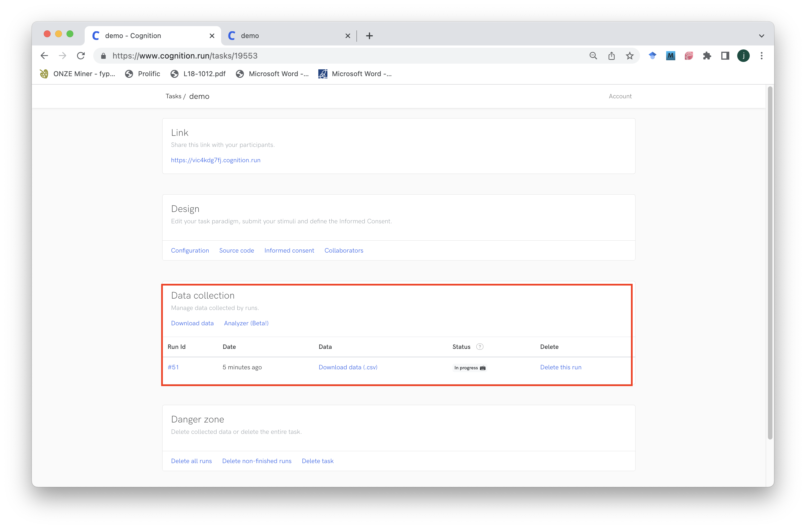

```{r echo=FALSE, warning=FALSE}
library(slickR)
library(htmltools)
library(xaringanExtra)
library(rmarkdown)
library(fontawesome)
library(bsplus)

```

```{r setup, warning=FALSE, echo=FALSE}
knitr::opts_chunk$set(echo = TRUE,
                      eval = FALSE,
                      comment = NA,
                      message = FALSE,
                      warning = FALSE)

knitr::knit_hooks$set(
  message = function(x, options) {
     paste('<button type="button" class="collapsible1"><strong>',
     fa(name = "circle-info"),
     ' more info</strong></button>', '<div class="content1"><p>',
     gsub('##', '\n', x),
     '</p></div>',
     sep = '\n')
   })

codeblock = function(x, options) {
     cat(paste('<div class="codeblock">',
     paste0(x),
     '</div>',
     sep = '\n'))
   }

```

---

## `r fa("language")` Translations available

Disclaimer: may not be very accurate...

<div id="google_translate_element"></div>

---

# Worksheet overview

## `r fa("crosshairs")` Aims

By the end of this worksheet you should be able to:

- **program** your own experiments in jsPsych
- **host** the experiment online using cognition.run
- **use** the participant data for analysis
- **apply** the basic skills you have learnt for your own purposes
- **learn** some extra skills such as HTML, javascript, CSS and JSON

## `r fa("user-graduate")` Pre-requisites

To complete the aims you will need to:

- **follow** this worksheet
- **ask** questions if you are not sure/be able to google
- **have** a working computer and internet connection
- **be patient** when things do not work

You do not need to:

- have any **programming knowledge**
- have high **computer literacy**
- know anything about **jsPsych, cognition.run, html, css or javascript**
- be a **linguist**

## `r fa("folder-tree")` Structure

The worksheet will go through the following sections:

- Making a complete experiment

    - running in full screen mode
    - presenting instructions
    - using consent forms
    - demographic questions and feedback
<br/><br/>
- Running other types of experiments

    - working with audio, images and video
    - self paced reading
    - rating experiments
    - conidtional and if trials
<br/><br/>
- Working with results files in R

    - loading in multiple files quickly
    - getting information from different parts of the experiment
    - converting json formatted data to columns

## `r fa("lightbulb")` Recap

In the last session we should have:

- built a lexical decision experiment
- learnt some basic css and html
- used plugins
- worked with timeline variables
- created json stimuli files using R

---

# Making a complete experiment

In the previous worksheet we were able to set up a working lexical decision experiment. However, this experiment only presented the lexical decision trials, with nothing else presented. This is probably not how we would want to run the experiment though. Instead, what would be good is to have various other parts to our experiment, so that we can ensure that the participant knows what to do.

In this section we will focus on adding in these parts.

## running in full screen mode

For online experiments, it is sensible to ensure that the participant has as few distractions whilst completing the experiment. One useful approach is to make the experiment run in full screen mode.

To do this we can use the `fullscreen` plugin.

https://www.jspsych.org/7.3/plugins/fullscreen/

This means we can present a message on the screen and a button. The message will probably say something to the participant and when they click on the button, the experiment will enter full screen mode.

```{js}
var enter_fullscreen = {
  type: jsPsychFullscreen,
  fullscreen_mode: true,
  message: '<p>some message</p>',
  button_label: 'enter full screen mode'
};

```

We will store the trial as a `var` called `enter_fullscreen`.

In the example above there are 4 different parameters:

`type` - this is where we specify the `jsPsychFullscreen` plugin

`fullscreen_mode` - this is `true` as we want the experiment to be in full screen mode when the button is clicked. If this is set to `false`, it will exit full screen mode when the button is clicked. You could use the `false` version if you want to let participants exit full screen mode manually, maybe at the end of the experiment

`message` - this is the message that will appear above the button on the screen. We can use this to inform the participant that when they click the button the experiment will enter full screen. You can say whatever you want here. Note the use of `<p>` at the start and `</p>` at the end. This is a `html tag` to say you want the text to be a `paragraph`. If you remove it, there will be no line break between the text and the button. You can use as many paragraph tags as you want, e.g. if you had `'<p>This is the first paragraph.</p><p>This is another paragraph.</p>`.

`button_label` - this is the text shown in the button. It can again be anything you want.

Don't forget, if we want to show the trial to the participant, we will have to `push` it to our timeline.

```{js}
timeline.push(enter_fullscreen);

```

## presenting instructions

To make sure that the participants understand what the basic outline of the experiment is, we need to present the participants with a general instruction page.

To do this we can use the `instructions` plugin.

https://www.jspsych.org/7.3/plugins/instructions/

This means we can present a message on the screen and a button.

```{js}
var instructions_page = {
    type: jsPsychInstructions,
    pages: [
    'Welcome to the experiment. Click next or press the Enter key to begin.',
    'In this experiment you will...'
    ],
    show_clickable_nav: true,
    key_forward: 'Enter',
    key_backward: 'ArrowLeft,
    allow_backward: true,
    button_label_next: 'next',
    button_label_previous: 'back'
};

```

We will store the trial as a `var` called `instructions_page`.

In the example above there are 7 different parameters:

`type` - this is where we specify the `jsPsychInstructions` plugin

`pages` - this takes an array, i.e. you use `[` and `]`, with the relevant information contained within the array.

The instructions are written as a string, e.g. 'Welcome to the experiment. Click next or press the Enter key to begin.'.If you want to show multiple instructions pages, you can separate them using a comma, e.g `pages: ['instructions page 1', 'instructions page 2']`.

The strings can be written simply without any formatting, or you can use html and css.

`show_clickable_nav` - this makes the buttons visible, e.g. you can see the 'next' and 'back' buttons underneath the instructions. If this is false, the buttons will not be shown

`key_forward` - this is the keyboard key that you specify if you want to allow the participant to press a key, as well as the button, to go to the next instructions page

`key_backward` - this is the keyboard key that you specify if you want to allow the participant to press a key, as well as the button, to go back to the last instructions page

`allow_backward` - this makes the back button/response active, so that the participant can go back to the previous instructions page. If this is false, the button/response to go back will not work

`button_label_next` - this is the text in the button to go to the next instructions page or finish the instructions. It is a string, but can also take html and css

`button_label_next` - this is the text in the button to go to the previous instructions page. It is a string, but can also take html and css


Don't forget, if we want to show the trial to the participant, we will have to `push` it to our timeline.

```{js}
timeline.push(instructions_page)

```

If you want to make the instructions page look a bit more fancy, we can use html and css for our instructions. For example, if you want to add a university/lab logo you can use html.

In the example below, we use an `img` html tag, to show an image from a link available on the internet.

Specifically https://sites2.ff.cuni.cz/ssol/wp-content/uploads/sites/103/2023/06/cropped-navrh_wider.png


We specify the source of the image, or where it is located using `src`, followed by a `=` then the link in quotations/`"`. If you want to use a file that you have uploaded to cognition.run, make sure you upload it to the stimuli section and then just specify the file name as the `src`, e.g. ''

```{js}
pages: ['']

```

You might notice that the image is not particularly a useful size. This is because we have to specify the size if we want it to be different from the original.

We can do this with `width` and `height` arguments, in the example below we specify the width as 400 and the height as 140, this is in pixels. You can just specify the width if you want to keep the aspect ratio the same as the original:

```{js}
pages: ['']

```

Finally, we can add a title to the page and the instructions themselves. This is all done using html and css.

Some quick html and css:

`` is an image tag, use it if you want to include images, these can be most image formats, even .gif

`<br/>` makes a line break

`<hr>` makes a horizontal rule across the width of the page

`<div>` is a divider

`style` is where you specify the css

`text-align: left` make the text left aligned

`margin-right: 150px` makes the right side margin set to 150px

`margin-left: 150px` makes the left side margin set to 150px

`<h2>` is a header tag, it makes the text a set size and bold, you can use it for titles

`<p>` is a paragraph tag, you can use it to make paragraphs

`<b>` is a bold font tag, it makes the text bold

```{js}
pages: ['</br><hr><div style="text-align: left; margin-right: 150px; margin-left: 150px;"><h2>Instructions</h2><p>In this experiment you will see a word on the screen.</p><p><b>If you think the word is a real word press the "e" key, if you do not think it is a real word, press the "i" key.</b></p><p>Press next to continue.</div>']

```

## using consent forms

If you are running an online experiment, you will likely be collecting data from participants that they need to consent to if they are to participate.

Once you have ethics approval, you will need to include a participant consent section, where the participant is shown the conditions of participation. If they are to participate they will need to confirm their consent.

We can again use the `instructions` plugin to do this.

In this example, we present just one page and have a button that clearly confirms the participant consenting to take part. There is only one option here, so if the participant wants to take part, they have to click the button.

```{js}
var consent_page = {
    type: jsPsychInstructions,
    pages: [
    'Details of informed consent...',
    ],
    show_clickable_nav: true,
    allow_backward: false,
    button_label_next: 'I consent to participating in this experiment'
};

```

## demographic questions and feedback

Another important part of an experiment is the collection of demographic information, such as age, gender, email address etc.

To do this we can use the `survey-html-form` plugin.

https://www.jspsych.org/7.3/plugins/survey-html-form/

This means we can present a variety of questions with different response options, e.g. radio buttons, checkboxes, text input etc.

```{js}
var demographics_page = {
  type: jsPsychSurveyHtmlForm,
  html: '<div style="text-align: left;">'+
  '<p>Question 1 </p><input id="Q1" name="Q1" type="text" />'+
  '<p>Question 2 </p><input id="Q2" name="Q2" type="number" />'+
  '<p>Question 3 </p><input id="Q3" name="Q3" type="email" />'+
  '<p>Question 4</p>'+
  '<input type="radio" id="Q4" name="Q4" value="a"><label>a</label><br>'+
  '<input type="radio" id="Q4" name="Q4" value="b"><label>b</label><br>'+
  '<input type="radio" id="Q4" name="Q4" value="c"><label>c</label><br>'+
  '<p>Question 5</p>'+
  '<input type="checkbox" id="Q5" name="Q5" value="a"><label>a</label><br>'+
  '<input type="checkbox" id="Q5" name="Q5" value="b"><label>b</label><br>'+
  '<input type="checkbox" id="Q5" name="Q4" value="c"><label>c</label><br>'+
  '<p>Question 6</p>'+
  `<textarea id="feedback_comments" name="feedback_comments" rows="4" cols="50"/></textarea>`+
  '</br></div>',
  button_label: 'next',
  autofocus: 'Q1'
};

```

We will store the trial as a `var` called `demographics_page`.

In the example above there are 4 different parameters:

`type` - this is where we specify the `jsPsychSurveyHtmlForm` plugin

`html` - this is where we write the survey code using html

`button_label` - this is where we give the text in the button

`autofocus` - this is where we can specify the focus to be on a specific question when the page loads. It takes the value from the `id` of a question in your html section

In order to understand how the html works, we will look at each part of the code. Note that the end of each line there is a `+` this means that it will interpret the lines as one big html chunk. This is simply to make it easier to read the html.

The first part of the html section is a `<div>` where we specify some css. All questions are within this `<div>` so all of them have the css applied.

`'<div style="text-align: left;">'+`

Here we use `text-align: left;` to make sure all the text is left aligned

In the above code we have 5 questions written in the `html` section:

## Question 1 - text input:

`'<p>Question 1 </p><input id="Q1" name="Q1" type="text" />'`

Here we start with a `<p>` tag, where we put the question text, i.e. Question 1

We then have an `<input>` tag, this means we are expecting some for of input response

We give the input an `id`, this should be unique for the specific question, e.g. "Q1"

We also give it a `name`, again this should be unique for the specific question, e.g. "Q1", this is important for when we get the data as the data will store the name and the response only

Finally we specify the `type` of input, here we use `"text"`, which will give us a text input field, the input provided by the participant will be stored in the data

## Question 2 - number input:

`'<p>Question 2 </p><input id="Q2" name="Q2" type="number" />'`

This question is similar to Question 1, but we have changed the type to `"number"` so only numeric values are allowed

## Question 3 - email input:

`'<p>Question 3 </p><input id="Q3" name="Q3" type="email" />'`

This question is similar to Question 1, but we have changed the type to `"email"` so only values containing an `@` are allowed

## Question 4 - radio button input:

```{js}
'<p>Question 4</p>'+
  '<input type="radio" id="Q4" name="Q4" value="a"><label>a</label><br>'+
  '<input type="radio" id="Q4" name="Q4" value="b"><label>b</label><br>'+
  '<input type="radio" id="Q4" name="Q4" value="c"><label>c</label><br>'+
  
```

This question use `"radio"` as the type, meaning you get a radio button selection as the response.

As well as the `id` and `name` options, we also include a `value`. The value is the information that will be stored in your data, so if the participant chooses the first button, they will have in their data `"Q4":"a"`, as they chose the "a" option for this question.

There is a `<label>` tag, this is important as it will provide the text that the participant sees next to the radio button. So `<label>a</label>` is the part of the code that is seen, but the `value` is what is stored in the data.

## Question 5 - checkbox input:

```{js}
'<p>Question 5</p>'+
  '<input type="checkbox" id="Q5" name="Q5" value="a"><label>a</label><br>'+
  '<input type="checkbox" id="Q5" name="Q5" value="b"><label>b</label><br>'+
  '<input type="checkbox" id="Q5" name="Q4" value="c"><label>c</label><br>'+
  
```

This is similar to Question 4, but instead of radio buttons we have `checkbox` as the type, meaning there are checkboxes as the input.

Now the participant can choose multiple options.

## Question 6 - textarea:

```{js}
'<p>Question 6</p>'+
  `<textarea id="feedback_comments" name="feedback_comments" rows="4" cols="50"/></textarea>`+
  
```

This question is similar to Question 1, in that it is a text input, but instead of using an `<input>` tag, we use the `<textarea>` tag, which allows us to specify additional options:

`rows="4"` means there are 4 rows, or the height of the box is 4 rows

`cols="50"` means there are 50 columns, or the width of the box is 50 columns

## required responses

If we want to make a question a forced response, i.e. the participant can not leave it blank, then we use the `required` option.

This is placed within the `<input>` tag.

So for Question 1 we would use:

`'<p>Question 1 </p><input id="Q1" name="Q1" type="text" required/>'`

This now means the question will give a warning when the participant tries to click on next, saying that they have to provide a response.

# Putting the whole experiment together

Now we have the following components:

- full screen mode
- instructions page
- consent page
- demographic form

If we combine this with the lexical decision experiment we made in the previous section, we would have something like this:

```{js}
// --------
// Title: Demo experiment
// jsPsych version: 7.3.1
// date: [today]
// author: [your name]
//----------

// inititate jspsych
var jsPsych = initJsPsych();

// set up main timeline
var timeline = [];

var enter_fullscreen = {
  type: jsPsychFullscreen,
  fullscreen_mode: true,
  message: '<p>some message</p>',
  button_label: 'enter full screen mode'
};

var instructions_page = {
    type: jsPsychInstructions,
    pages: [
    '</br><hr><div style="text-align: left; margin-right: 150px; margin-left: 150px;"><h2>Instructions</h2><p>In this experiment you will see a word on the screen.</p><p><b>If you think the word is a real word press the "e" key, if you do not think it is a real word, press the "i" key.</b></p><p>Press next to continue.</div>',
    'In this experiment you will...'
    ],
    show_clickable_nav: true,
    key_forward: 'Enter',
    key_backward: 'ArrowLeft',
    allow_backward: true,
    show_clickable_nav: true,
    button_label_previous: '<b>next</b>',
    button_label_next: 'next'
};

var consent_page = {
    type: jsPsychInstructions,
    pages: [
    'Details of informed consent...',
    ],
    show_clickable_nav: true,
    allow_backward: false,
    button_label_next: 'I consent to participating in this experiment'
};

  var demographics_page = {
  type: jsPsychSurveyHtmlForm,
  html: '<div style="text-align: left;">'+
  '<p>Question 1 </p><input id="Q1" name="Q1" type="text" />'+
  '<p>Question 2 </p><input id="Q2" name="Q2" type="number" />'+
  '<p>Question 3 </p><input id="Q3" name="Q3" type="email" />'+
  '<p>Question 4</p>'+
  '<input type="radio" id="Q4" name="Q4" value="a"><label>a</label><br>'+
  '<input type="radio" id="Q4" name="Q4" value="b"><label>b</label><br>'+
  '<input type="radio" id="Q4" name="Q4" value="c"><label>c</label><br>'+
  '<p>Question 5</p>'+
  '<input type="checkbox" id="Q5" name="Q5" value="a"><label>a</label><br>'+
  '<input type="checkbox" id="Q5" name="Q5" value="b"><label>b</label><br>'+
  '<input type="checkbox" id="Q5" name="Q4" value="c"><label>c</label><br>'+
  '<p>Question 6</p>'+
  `<textarea id="feedback_comments" name="feedback_comments" rows="4" cols="50"/></textarea>`+
  '</br></div>',
  button_label: 'next',
  autofocus: 'Q1'
};

var lexical_decision_trial = {
  type: jsPsychHtmlKeyboardResponse,
  stimulus: jsPsych.timelineVariable("item"),
  choices: ['d', 'h'],
  prompt: '<div style="font-size:12pt; position:relative; bottom:150px;">press "d" if you think it is a real word, press "h" if you think it is not a real word</div>',
  data: {
    task: 'lexical_decision',
    real_word: jsPsych.timelineVariable('real_word'),
    correct_key: jsPsych.timelineVariable('correct_key')
    }
};

var fixation_trial = {
  type: jsPsychHtmlKeyboardResponse,
  stimulus: '<div style="font-size:30pt;">+</div>',
  choices: 'NO_KEYS',
  prompt: '<div style="font-size:10pt; position:relative; bottom:150px;"><br/></div>',
  trial_duration: 500,
  data: {
    task: 'fixation'
  }
};

var lexical_decision_combined = {
  timeline: [fixation_trial, lexical_decision_trial],
  timeline_variables: stimuli,
  randomize_order: true
};

timeline.push(enter_fullscreen);
timeline.push(instructions_page);
timeline.push(consent_page);
timeline.push(demographics_page);

// push the lexical_decision_combined variable to the timeline
timeline.push(lexical_decision_combined);

//run the experiment
jsPsych.run(timeline);

```

We can now go back to the experiment dashboard in cognition.run by clicking on the `demo` button. This might look different if you named your experiment something else.



We can now use the `link` option to see how the experiment looks in the live version.



When you click on the link you should see a new tab open that has your working experiment.

You can distribute this link to participants and collect your data.

Once the participant has completed the experiment you will see their data appear in the dashboard.



You can download the data from cognition.run and then analyse it.

# Working with results files in R

## loading in multiple files quickly

## getting information from different parts of the experiment

## converting json formatted data to columns


# Running other types of experiments

## working with audio, images and video

## self paced reading

## rating experiments

## conidtional and if trials


```{r echo=FALSE, eval=TRUE, warning=FALSE}
htmltools::tags$script(src = "js/translate.js")
# htmltools::tags$script(src = "js/infobox.js")
htmltools::tags$script(src="//translate.google.com/translate_a/element.js?cb=googleTranslateElementInit")

htmltools::tagList(
  xaringanExtra::use_clipboard(
    button_text = "<i class=\"fa fa-clipboard\" style=\"font-size: 25px\"></i>",
    success_text = "<i class=\"fa fa-check\" style=\"color: #90BE6D; font-size: 25px\"></i>",
  ),
  rmarkdown::html_dependency_font_awesome()
)

```

```{js echo=FALSE, eval=TRUE}
var coll = document.getElementsByClassName("collapsible1");
var i;

for (i = 0; i < coll.length; i++) {
  coll[i].addEventListener("click", function() {
    this.classList.toggle("active1");
    var content = this.nextElementSibling;
    if (content.style.maxHeight){
      content.style.maxHeight = null;
    } else {
      content.style.maxHeight = content.scrollHeight + "px";
    }
  });
}

```
