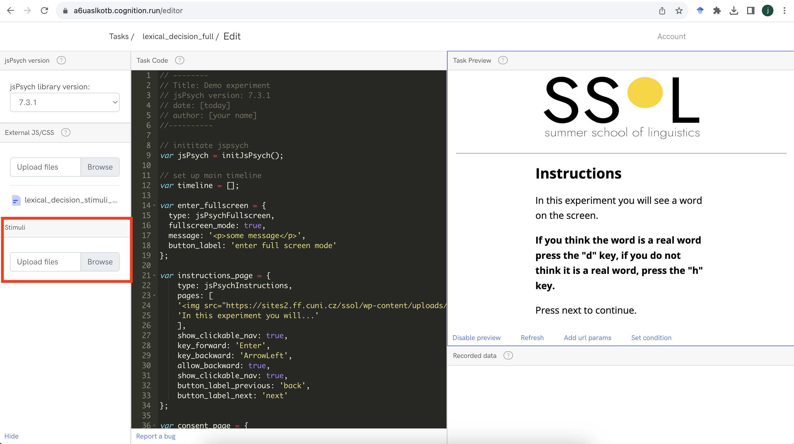

```{r echo=FALSE, warning=FALSE}
library(slickR)
library(htmltools)
library(xaringanExtra)
library(rmarkdown)
library(fontawesome)
library(bsplus)
library(DT)

```

```{r setup, warning=FALSE, echo=FALSE}
knitr::opts_chunk$set(echo = TRUE,
                      eval = FALSE,
                      comment = NA,
                      message = FALSE,
                      warning = FALSE)

knitr::knit_hooks$set(
  message = function(x, options) {
     paste('<button type="button" class="collapsible1"><strong>',
     fa(name = "circle-info"),
     ' more info</strong></button>', '<div class="content1"><p>',
     gsub('##', '\n', x),
     '</p></div>',
     sep = '\n')
   })

codeblock = function(x, options) {
     cat(paste('<div class="codeblock">',
     paste0(x),
     '</div>',
     sep = '\n'))
   }

```

---

## `r fa("language")` Translations available

Disclaimer: may not be very accurate...

<div id="google_translate_element"></div>

---

# Worksheet overview

## `r fa("crosshairs")` Aims

By the end of this worksheet you should be able to:

- **program** your own experiments in jsPsych
- **host** the experiment online using cognition.run
- **use** the participant data for analysis
- **apply** the basic skills you have learnt for your own purposes
- **learn** some extra skills such as HTML, javascript, CSS and JSON

## `r fa("user-graduate")` Pre-requisites

To complete the aims you will need to:

- **follow** this worksheet
- **ask** questions if you are not sure/be able to google
- **have** a working computer and internet connection
- **be patient** when things do not work

You do not need to:

- have any **programming knowledge**
- have high **computer literacy**
- know anything about **jsPsych, cognition.run, html, css or javascript**
- be a **linguist**

## `r fa("folder-tree")` Structure

The worksheet will go through the following sections:

- Running other types of experiments

    - working with audio
    - working with images
    - working with images and audio
    <!-- - conditional and if trials -->
<br/><br/>
- Working with results files in R

    - loading in multiple files quickly
    - getting information from different parts of the experiment
    - converting json formatted data to columns

## `r fa("lightbulb")` Recap

In the last session we should have:

- Running in full screen mode
- Presenting instructions
- Using consent forms
- Demographic questions
- Feedback forms
- Distributing links

---

<!-- # Working with results files in R -->

<!-- ## loading in multiple files quickly -->

<!-- ## getting information from different parts of the experiment -->

<!-- ## converting json formatted data to columns -->


# Running other types of experiments

In this section, we will focus on different types of experiments that are more advanced than the lexical decision experiment we have already programmed.

# Audio stimuli

A common adaption to the lexical decision experiment is the auditory version, where instead of text on the screen the participant hears an audio recording. To run this type of experiment we will need to use audio files.

## audio files

We will use a set of audio files that have the same words and non-words as we used in the text version.

You can download the audio files as a .zip folder at this link.

`r fa("download")` [jspsych_audio_stimuli.zip](https://github.com/jamesbrandscience/jspsych-tutorial/raw/main/jspsych_audio_stimuli.zip)

There should be 20 files, each named something like `fox.wav`.

In cognition.run we can now upload these files so that they are stored in the experiment. Click the `browse` button and choose the audio files that were in the .zip folder. You can select all the files and upload them in one go.



## stimuli file

Now we need to update the stimuli file, so that we are reading in the audio `.wav` files, instead of the text.

To do this, we need to create a new version of our `lexical_decision_stimuli.csv` file.

Change each of the words in the `item` column so that there is `.wav` at the end, e.g. `fox` should be `fox.wav`.

Save the file as a .csv, called `lexical_decision_stimuli_audio.csv`.

The data should look like this:

```{r echo=FALSE, eval=TRUE, warning=FALSE}
datatable(data.frame(item = c("fox.wav", "cheese.wav", "sheep.wav", "banana.wav", "chair.wav", "pea.wav", "heart.wav", "pumpkin.wav", "cucumber.wav", "hippo.wav", "fzx.wav", "cheesx.wav", "shxxp.wav", "banxna.wav", "chxir.wav", "pxa.wav", "hexrt.wav", "pumpkxn.wav", "cxcumber.wav", "hxppo.wav"),
                 real_word = c(rep("yes", 10), rep("no", 10)),
                 correct_key = c(rep("d", 10), rep("h", 10))), rownames = FALSE, filter = "none", autoHideNavigation = TRUE, options = list(dom = 't', pageLength = 20))

```

Now we need to go to R and process the .csv file to json format.

We can use the same code to go from csv to json to js as we did in session 2:

```{r eval=FALSE, echo=TRUE}
paste0("var stimuli = ",
       toJSON(read_delim("lexical_decision_stimuli_audio.csv", delim = ";"),
              pretty=TRUE),
       ";") %>%
  write_file(file = "lexical_decision_stimuli_audio_JSON.js")

```

We should now have a file called `lexical_decision_stimuli_audio_JSON.js`, which we can upload to cognition.run in the `external JS/CSS` section.

If you need this file, you can download it:

`r fa("download")` [lexical_decision_stimuli_audio_JSON.js](https://github.com/jamesbrandscience/jspsych-tutorial/raw/main/lexical_decision_stimuli_JSON.js).

## audio-keyboard-response

The last thing we need to change in our jspsych code is the plugin type.

In our code we should have:

```{js}
var lexical_decision_trial = {
  type: jsPsychHtmlKeyboardResponse,
  stimulus: jsPsych.timelineVariable("item"),
  choices: ['d', 'h'],
  prompt: '<div style="font-size:12pt; position:relative; bottom:150px;">press "d" if you think it is a real word, press "h" if you think it is not a real word</div>',
  data: {
    task: 'lexical_decision',
    real_word: jsPsych.timelineVariable('real_word'),
    correct_key: jsPsych.timelineVariable('correct_key')
    }
};

```

But in order for our audio files to be read properly, we need to change the plugin type.

If we change the `type` argument from `jsPsychHtmlKeyboardResponse` to `jsPsychAudioKeyboardResponse`, we should now see that the experiment will play the audio files and not present the words.

So the final code for a simple auditory lexical decision experiment would be:

```{js}
// --------
// Title: Demo experiment
// jsPsych version: 7.3.1
// date: [today]
// author: [your name]
//----------

// inititate jspsych
var jsPsych = initJsPsych();

// set up main timeline
var timeline = [];

var lexical_decision_trial = {
  type: jsPsychAudioKeyboardResponse,
  stimulus: jsPsych.timelineVariable("item"),
  choices: ['d', 'h'],
  prompt: '<div style="font-size:12pt; position:relative; bottom:150px;">press "d" if you think it is a real word, press "h" if you think it is not a real word</div>',
  data: {
    task: 'lexical_decision',
    real_word: jsPsych.timelineVariable('real_word'),
    correct_key: jsPsych.timelineVariable('correct_key')
    }
};

var fixation_trial = {
  type: jsPsychHtmlKeyboardResponse,
  stimulus: '<div style="font-size:30pt;">+</div>',
  choices: 'NO_KEYS',
  prompt: '<div style="font-size:10pt; position:relative; bottom:150px;"><br/></div>',
  trial_duration: 500,
  data: {
    task: 'fixation'
  }
};

var lexical_decision_combined = {
  timeline: [fixation_trial, lexical_decision_trial],
  timeline_variables: stimuli,
  randomize_order: true
};

timeline.push(lexical_decision_combined);

//run the experiment
jsPsych.run(timeline);

```


# Image stimuli

Another common design is to present an image to the participant and ask them to respond with a key press. We can present images in the same way as we presented text and audio, i.e. keeping the same code as before, but making some small changes and using different stimuli.

In this experiment, we will present an image on the screen and ask participants to press a button if they would eat the thing represented by the image, an eating decision experiment.

## image files

We will use a set of image files that have the same referents as we used in the text version, when they were real words.

You can download the audio files as a .zip folder at this link.

`r fa("download")` [jspsych_image_stimuli.zip](https://github.com/jamesbrandscience/jspsych-tutorial/raw/main/jspsych_image_stimuli.zip)

There should be 10 files, each named something like `fox.png`. These files are from the Multipic database https://www.bcbl.eu/databases/multipic/

In cognition.run we can now upload these files so that they are stored in the experiment. Click the `browse` button and choose the image files that were in the .zip folder. You can select all the files and upload them in one go.

## stimuli file

Now we need to update the stimuli file, so that we are reading in the image `.png` files, instead of the text.

To do this, we need to create a new version of our `lexical_decision_stimuli.csv` file.

Change each of the words in the `item` column so that there is `.png` at the end, e.g. `fox` should be `fox.png` and change the `real_word` column to `eat`, representing whether you would eat the thing, then update the `correct_key` column - d = eat, h = do not eat.

Save the file as a .csv, called `lexical_decision_stimuli_image.csv`.

The data should look like this:

```{r echo=FALSE, eval=TRUE, warning=FALSE}
datatable(data.frame(item = c("fox.png", "cheese.png", "sheep.png", "banana.png", "chair.png", "pea.png", "heart.png", "pumpkin.png", "cucumber.png", "hippo.png"),
                 eat = c("no", "yes", "no", "yes", "no", "yes", "no", "yes", "yes", "no"),
                 correct_key = c("h", "d", "h", "d", "h", "d", "h", "d", "d", "h")), rownames = FALSE, filter = "none", autoHideNavigation = TRUE, options = list(dom = 't', pageLength = 10))

```

Now we need to go to R and process the .csv file to json format.

We can use the same code to go from csv to json to js as we did in session 2:

```{r eval=FALSE, echo=TRUE}
paste0("var stimuli = ",
       toJSON(read_delim("lexical_decision_stimuli_image.csv", delim = ";"),
              pretty=TRUE),
       ";") %>%
  write_file(file = "lexical_decision_stimuli_image_JSON.js")

```

We should now have a file called `lexical_decision_stimuli_audio_JSON.js`, which we can upload to cognition.run in the `external JS/CSS` section.

If you need this file, you can download it:

`r fa("download")` [lexical_decision_stimuli_audio_JSON.js](https://github.com/jamesbrandscience/jspsych-tutorial/raw/main/lexical_decision_stimuli_JSON.js).

## image-keyboard-response

The last thing we need to change in our jspsych code is the plugin type.

If we change the `type` argument from `jsPsychHtmlKeyboardResponse` to `jsPsychImageKeyboardResponse`, we should now see that the experiment will show the image files and not present the words.


So the final code for a simple auditory lexical decision experiment would be:

```{js}
// --------
// Title: Demo experiment
// jsPsych version: 7.3.1
// date: [today]
// author: [your name]
//----------

// inititate jspsych
var jsPsych = initJsPsych();

// set up main timeline
var timeline = [];

var lexical_decision_trial = {
  type: jsPsychAudioKeyboardResponse,
  stimulus: jsPsych.timelineVariable("item"),
  choices: ['d', 'h'],
  prompt: '<div style="font-size:12pt; position:relative; bottom:150px;">press "d" if you think it is a real word, press "h" if you think it is not a real word</div>',
  data: {
    task: 'lexical_decision',
    real_word: jsPsych.timelineVariable('real_word'),
    correct_key: jsPsych.timelineVariable('correct_key')
    }
};

var fixation_trial = {
  type: jsPsychHtmlKeyboardResponse,
  stimulus: '<div style="font-size:30pt;">+</div>',
  choices: 'NO_KEYS',
  prompt: '<div style="font-size:10pt; position:relative; bottom:150px;"><br/></div>',
  trial_duration: 500,
  data: {
    task: 'fixation'
  }
};

var lexical_decision_combined = {
  timeline: [fixation_trial, lexical_decision_trial],
  timeline_variables: stimuli,
  randomize_order: true
};

timeline.push(lexical_decision_combined);

//run the experiment
jsPsych.run(timeline);

```

# Audio and image stimuli

# Working with results in R


<!-- # Conditional and if trials -->


```{r echo=FALSE, eval=TRUE, warning=FALSE}
htmltools::tags$script(src = "js/translate.js")
# htmltools::tags$script(src = "js/infobox.js")
htmltools::tags$script(src="//translate.google.com/translate_a/element.js?cb=googleTranslateElementInit")

htmltools::tagList(
  xaringanExtra::use_clipboard(
    button_text = "<i class=\"fa fa-clipboard\" style=\"font-size: 25px\"></i>",
    success_text = "<i class=\"fa fa-check\" style=\"color: #90BE6D; font-size: 25px\"></i>",
  ),
  rmarkdown::html_dependency_font_awesome()
)

```

```{js echo=FALSE, eval=TRUE}
var coll = document.getElementsByClassName("collapsible1");
var i;

for (i = 0; i < coll.length; i++) {
  coll[i].addEventListener("click", function() {
    this.classList.toggle("active1");
    var content = this.nextElementSibling;
    if (content.style.maxHeight){
      content.style.maxHeight = null;
    } else {
      content.style.maxHeight = content.scrollHeight + "px";
    }
  });
}

```
