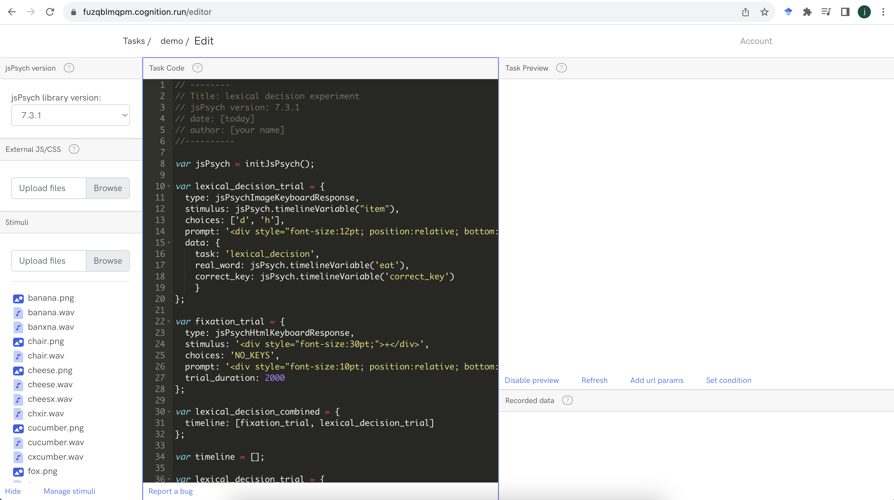
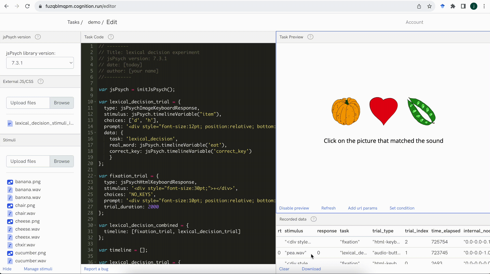

```{r echo=FALSE, warning=FALSE}
library(slickR)
library(htmltools)
library(xaringanExtra)
library(rmarkdown)
library(fontawesome)
library(bsplus)
library(DT)

```

```{r setup, warning=FALSE, echo=FALSE}
knitr::opts_chunk$set(echo = TRUE,
                      eval = FALSE,
                      comment = NA,
                      message = FALSE,
                      warning = FALSE)

knitr::knit_hooks$set(
  message = function(x, options) {
     paste('<button type="button" class="collapsible1"><strong>',
     fa(name = "circle-info"),
     ' more info</strong></button>', '<div class="content1"><p>',
     gsub('##', '\n', x),
     '</p></div>',
     sep = '\n')
   })

codeblock = function(x, options) {
     cat(paste('<div class="codeblock">',
     paste0(x),
     '</div>',
     sep = '\n'))
   }

```

---

## `r fa("language")` Translations available

Disclaimer: may not be very accurate...

<div id="google_translate_element"></div>

---

# Worksheet overview

## `r fa("crosshairs")` Aims

By the end of this worksheet you should be able to:

- **program** your own experiments in jsPsych
- **host** the experiment online using cognition.run
- **use** the participant data for analysis
- **apply** the basic skills you have learnt for your own purposes
- **learn** some extra skills such as HTML, javascript, CSS and JSON

## `r fa("user-graduate")` Pre-requisites

To complete the aims you will need to:

- **follow** this worksheet
- **ask** questions if you are not sure/be able to google
- **have** a working computer and internet connection
- **be patient** when things do not work

You do not need to:

- have any **programming knowledge**
- have high **computer literacy**
- know anything about **jsPsych, cognition.run, html, css or javascript**
- be a **linguist**

## `r fa("folder-tree")` Structure

The worksheet will go through the following sections:

- Running other types of experiments

    - working with audio
    - working with images
    - working with images and audio
    <!-- - conditional and if trials -->
<br/><br/>
- Working with results files in R

    - loading in multiple files quickly
    - getting information from different parts of the experiment
    - converting json formatted data to columns

## `r fa("lightbulb")` Recap

In the last session we should have:

- Running in full screen mode
- Presenting instructions
- Using consent forms
- Demographic questions
- Feedback forms
- Distributing links

---

<!-- # Working with results files in R -->

<!-- ## loading in multiple files quickly -->

<!-- ## getting information from different parts of the experiment -->

<!-- ## converting json formatted data to columns -->


# Running other types of experiments

In this section, we will focus on different types of experiments that are more advanced than the lexical decision experiment we have already programmed.

# Audio stimuli

A common adaption to the lexical decision experiment is the auditory version, where instead of text on the screen the participant hears an audio recording. To run this type of experiment we will need to use audio files.

## audio files

We will use a set of audio files that have the same words and non-words as we used in the text version.

You can download the audio files as a .zip folder at this link.

`r fa("download")` [jspsych_audio_stimuli.zip](https://github.com/jamesbrandscience/jspsych-tutorial/raw/main/jspsych_audio_stimuli.zip)

There should be 20 files, each named something like `fox.wav`.

In cognition.run we can now upload these files so that they are stored in the experiment. Click the `browse` button and choose the audio files that were in the .zip folder. You can select all the files and upload them in one go.


## stimuli file

Now we need to update the stimuli file, so that we are reading in the audio `.wav` files, instead of the text.

To do this, we need to create a new version of our `lexical_decision_stimuli.csv` file.

Change each of the words in the `item` column so that there is `.wav` at the end, e.g. `fox` should be `fox.wav`.

Save the file as a .csv, called `lexical_decision_stimuli_audio.csv`.

The data should look like this:

```{r echo=FALSE, eval=TRUE, warning=FALSE}
datatable(data.frame(item = c("fox.wav", "cheese.wav", "sheep.wav", "banana.wav", "chair.wav", "pea.wav", "heart.wav", "pumpkin.wav", "cucumber.wav", "hippo.wav", "fzx.wav", "cheesx.wav", "shxxp.wav", "banxna.wav", "chxir.wav", "pxa.wav", "hexrt.wav", "pumpkxn.wav", "cxcumber.wav", "hxppo.wav"),
                 real_word = c(rep("yes", 10), rep("no", 10)),
                 correct_key = c(rep("d", 10), rep("h", 10))), rownames = FALSE, filter = "none", autoHideNavigation = TRUE, options = list(dom = 't', pageLength = 20))

```

Now we need to go to R and process the .csv file to json format.

We can use the same code to go from csv to json to js as we did in session 2:

```{r eval=FALSE, echo=TRUE}
paste0("var stimuli = ",
       toJSON(read_delim("lexical_decision_stimuli_audio.csv", delim = ";"),
              pretty=TRUE),
       ";") %>%
  write_file(file = "lexical_decision_stimuli_audio_JSON.js")

```

We should now have a file called `lexical_decision_stimuli_audio_JSON.js`, which we can upload to cognition.run in the `external JS/CSS` section.

If you need this file, you can download it:

`r fa("download")` [lexical_decision_stimuli_audio_JSON.js](https://github.com/jamesbrandscience/jspsych-tutorial/raw/main/lexical_decision_stimuli_audio_JSON.js).

## audio-keyboard-response

The last thing we need to change in our jspsych code is the plugin type.

In our code we should have:

```{js}
var lexical_decision_trial = {
  type: jsPsychHtmlKeyboardResponse,
  stimulus: jsPsych.timelineVariable("item"),
  choices: ['d', 'h'],
  prompt: '<div style="font-size:12pt; position:relative; bottom:150px;">press "d" if you think it is a real word, press "h" if you think it is not a real word</div>',
  data: {
    task: 'lexical_decision',
    real_word: jsPsych.timelineVariable('real_word'),
    correct_key: jsPsych.timelineVariable('correct_key')
    }
};

```

But in order for our audio files to be read properly, we need to change the plugin type.

If we change the `type` argument from `jsPsychHtmlKeyboardResponse` to `jsPsychAudioKeyboardResponse`, we should now see that the experiment will play the audio files and not present the words.

So the final code for a simple auditory lexical decision experiment would be:

```{js}
// --------
// Title: Demo experiment
// jsPsych version: 7.3.1
// date: [today]
// author: [your name]
//----------

// inititate jspsych
var jsPsych = initJsPsych();

// set up main timeline
var timeline = [];

var lexical_decision_trial = {
  type: jsPsychAudioKeyboardResponse,
  stimulus: jsPsych.timelineVariable("item"),
  choices: ['d', 'h'],
  prompt: '<div style="font-size:12pt; position:relative; bottom:150px;">press "d" if you think it is a real word, press "h" if you think it is not a real word</div>',
  data: {
    task: 'lexical_decision',
    real_word: jsPsych.timelineVariable('real_word'),
    correct_key: jsPsych.timelineVariable('correct_key')
    }
};

var fixation_trial = {
  type: jsPsychHtmlKeyboardResponse,
  stimulus: '<div style="font-size:30pt;">+</div>',
  choices: 'NO_KEYS',
  prompt: '<div style="font-size:10pt; position:relative; bottom:150px;"><br/></div>',
  trial_duration: 500,
  data: {
    task: 'fixation'
  }
};

var lexical_decision_combined = {
  timeline: [fixation_trial, lexical_decision_trial],
  timeline_variables: stimuli,
  randomize_order: true
};

timeline.push(lexical_decision_combined);

//run the experiment
jsPsych.run(timeline);

```


# Image stimuli

Another common design is to present an image to the participant and ask them to respond with a key press. We can present images in the same way as we presented text and audio, i.e. keeping the same code as before, but making some small changes and using different stimuli.

In this experiment, we will present an image on the screen and ask participants to press a button if they would eat the thing represented by the image, an eating decision experiment.

## image files

We will use a set of image files that have the same referents as we used in the text version, when they were real words.

You can download the audio files as a .zip folder at this link.

`r fa("download")` [jspsych_image_stimuli.zip](https://github.com/jamesbrandscience/jspsych-tutorial/raw/main/jspsych_image_stimuli.zip)

There should be 10 files, each named something like `fox.png`. These files are from the Multipic database https://www.bcbl.eu/databases/multipic/

In cognition.run we can now upload these files so that they are stored in the experiment. Click the `browse` button and choose the image files that were in the .zip folder. You can select all the files and upload them in one go.

## stimuli file

Now we need to update the stimuli file, so that we are reading in the image `.png` files, instead of the text.

To do this, we need to create a new version of our `lexical_decision_stimuli.csv` file.

Change each of the words in the `item` column so that there is `.png` at the end, e.g. `fox` should be `fox.png` and change the `real_word` column to `eat`, representing whether you would eat the thing, then update the `correct_key` column - d = eat, h = do not eat.

Save the file as a .csv, called `lexical_decision_stimuli_image.csv`.

The data should look like this:

```{r echo=FALSE, eval=TRUE, warning=FALSE}
datatable(data.frame(item = c("fox.png", "cheese.png", "sheep.png", "banana.png", "chair.png", "pea.png", "heart.png", "pumpkin.png", "cucumber.png", "hippo.png"),
                 eat = c("no", "yes", "no", "yes", "no", "yes", "no", "yes", "yes", "no"),
                 correct_key = c("h", "d", "h", "d", "h", "d", "h", "d", "d", "h")), rownames = FALSE, filter = "none", autoHideNavigation = TRUE, options = list(dom = 't', pageLength = 10))

```

Now we need to go to R and process the .csv file to json format.

We can use the same code to go from csv to json to js as we did in session 2:

```{r eval=FALSE, echo=TRUE}
paste0("var stimuli = ",
       toJSON(read_delim("lexical_decision_stimuli_image.csv", delim = ";"),
              pretty=TRUE),
       ";") %>%
  write_file(file = "lexical_decision_stimuli_image_JSON.js")

```

We should now have a file called `lexical_decision_stimuli_image_JSON.js`, which we can upload to cognition.run in the `external JS/CSS` section.

If you need this file, you can download it:

`r fa("download")` [lexical_decision_stimuli_image_JSON.js](https://github.com/jamesbrandscience/jspsych-tutorial/raw/main/lexical_decision_stimuli_image_JSON.js).

## image-keyboard-response

The last thing we need to change in our jspsych code is the plugin type.

If we change the `type` argument from `jsPsychHtmlKeyboardResponse` to `jsPsychImageKeyboardResponse`, we should now see that the experiment will show the image files and not present the words.

So the final code for a simple auditory lexical decision experiment would be:

```{js}
// --------
// Title: Demo experiment
// jsPsych version: 7.3.1
// date: [today]
// author: [your name]
//----------

// inititate jspsych
var jsPsych = initJsPsych();

// set up main timeline
var timeline = [];

var lexical_decision_trial = {
  type: jsPsychImageKeyboardResponse,
  stimulus: jsPsych.timelineVariable("item"),
  choices: ['d', 'h'],
  prompt: '<div style="font-size:12pt; position:relative; bottom:150px;">press "d" if you think it is something you would eat, press "h" if you think it is not</div>',
  data: {
    task: 'lexical_decision',
    real_word: jsPsych.timelineVariable('eat'),
    correct_key: jsPsych.timelineVariable('correct_key')
    }
};

var fixation_trial = {
  type: jsPsychHtmlKeyboardResponse,
  stimulus: '<div style="font-size:30pt;">+</div>',
  choices: 'NO_KEYS',
  prompt: '<div style="font-size:10pt; position:relative; bottom:150px;"><br/></div>',
  trial_duration: 500,
  data: {
    task: 'fixation'
  }
};

var lexical_decision_combined = {
  timeline: [fixation_trial, lexical_decision_trial],
  timeline_variables: stimuli,
  randomize_order: true
};

timeline.push(lexical_decision_combined);

//run the experiment
jsPsych.run(timeline);

```

# Audio and image stimuli

You might want to design an experiment where you present an audio file and the participant has to make a decision based on which image to choose. This can be easily implemented.

In this example, we will use both the audio and image files together in a trial using the `jsPsychAudioButtonResponse` plugin.

## audio and image files

We will present three images on the screen, one on the left, one in the center and one on the right of the screen. Together with the images, the participant will hear an audio file, containing a word or non-word. We will use the same image and audio files as in the previous sections.

To make sure the files will be loaded in to jspsych, we should upload them all to cognition.run. You can do this following the same steps as before.



## stimuli file

Our stimuli file will look a little bit different this time. As we will have three images and an audio file, we will need our stimuli file to have this specific information included.

We will make a csv file which has the following columns: `image_left`, `image_center`, `image_right`, `audio`, `real_word`, `correct_choice`.

This is what the stimuli file should look like:

```{r echo=FALSE, eval=TRUE, warning=FALSE}
datatable(data.frame(image_left = c("fox.png", "cheese.png", "sheep.png", "banana.png", "chair.png", "pea.png", "heart.png", "pumpkin.png", "cucumber.png", "hippo.png"),
                     image_center = c("hippo.png", "fox.png", "cheese.png", "sheep.png", "banana.png", "chair.png", "pea.png", "heart.png", "pumpkin.png", "cucumber.png"),
                     image_right = c("cucumber.png", "hippo.png", "fox.png", "cheese.png", "sheep.png", "banana.png", "chair.png", "pea.png", "heart.png", "pumpkin.png"),
                     audio = c("fox.wav", "cheesx.wav", "sheep.wav", "banxna.wav", "banana.wav", "chxir.wav", "pea.wav", "pxa.wav", "heart.wav", "pumpkxn.wav"),
                     real_word = c("yes", "no", "yes", "no", "yes", "no", "yes", "no", "yes", "no"),
                     correct_choice = c("0", "0", "0", "0", "1", "1", "1", "2", "2", "2")), rownames = FALSE, filter = "none", autoHideNavigation = TRUE, options = list(dom = 't', pageLength = 10))

```
Note that the `correct_choice` column has values of `0`, `1` and `2`. In jspsych these correspond to the order of the buttons used in the html-button-response plugin. When a participant chooses a button, the response will be stored as a value, so if there are 3 buttons, there will be either `0`, `1` or `2`. We will see how this works when we make our trial and look at the data.

Once you have the data set up as a spreadsheet, or other file, export it to a .csv file called `lexical_decision_stimuli_image_audio.csv`.

If you need this file, you can download it:

`r fa("download")` [lexical_decision_stimuli_image_audio.csv](https://github.com/jamesbrandscience/jspsych-tutorial/raw/main/lexical_decision_stimuli_image_audio.csv).

Then we can use R to process the csv file to a js file in json format.

```{r eval=FALSE, echo=TRUE}
paste0("var stimuli = ",
       toJSON(read_delim("lexical_decision_stimuli_image_audio.csv", delim = ";"),
              pretty=TRUE),
       ";") %>%
  write_file(file = "lexical_decision_stimuli_image_audio_JSON.js")

```

Once we have the file, we can upload it to cognition.run, like we did for the previous examples.

If you need this file, you can download it:

`r fa("download")` [lexical_decision_stimuli_image_audio_JSON.js](https://github.com/jamesbrandscience/jspsych-tutorial/raw/main/lexical_decision_stimuli_image_audio_JSON.js).

## jsPsychAudioButtonResponse

We will use a slightly different plugin for this type of trial. We can use a button response instead of a keyboard response so that participants can click on the picture they want to select, so we will use `jsPsychAudioButtonResponse`.

Here is how our trial will look:

```{js}
var lexical_decision_trial = {
    type: jsPsychAudioButtonResponse,
    stimulus: jsPsych.timelineVariable("audio"),
    choices: [
      jsPsych.timelineVariable("image_left"),
      jsPsych.timelineVariable("image_center"),
      jsPsych.timelineVariable("image_right")
      ],
    prompt: "<p>Click on the picture that matched the sound</p>",
    button_html: '',
    data: {
      task: 'lexical_decision',
      image_left: jsPsych.timelineVariable("image_left"),
      image_center: jsPsych.timelineVariable("image_center"),
      image_right: jsPsych.timelineVariable("image_right"), 
      real_word: jsPsych.timelineVariable('real_word'),
      correct_choice: jsPsych.timelineVariable('correct_choice')
    }
};

```

In this trial there are some differences in the code that might need explaining.

```
stimulus: jsPsych.timelineVariable("audio")
```
This is where we specify that we want to have the files from the audio column in our stimuli played

```
choices: [
  jsPsych.timelineVariable("image_left"),
  jsPsych.timelineVariable("image_center"),
  jsPsych.timelineVariable("image_right")
  ]
```
This is where we specify the buttons that will be displayed in our trial.

The order that you specify these items is important. The first item, image_left, will be the first button and appear on the left. It will also have a value of `0` if a participant chooses it. If you only had this one item it will appear in the middle. The second item will have a value of `1` and should appear in the center, if there are three items. The thrid item will have a value of `2` and should appear to the left.

Note that we are referring to timeline variables, but they are image files so we need to specify this in the `button_html` parameter, otherwise they will just show the text version of the filename.

```
button_html: ''
```
This is where we specify that the choices should be displayed as images. We do this with the html `` tag and then specify the `src=%choice%` which will be interpreted as reading the filenames from our timeline variables specified in the `choices` parameter.

We also add a `width` argument, this is quite important as the images would be too big in their dimensions to fit together in one line if we used the default size.

This is how the final code should look like:

```{js}
// --------
// Title: lexical decision experiment
// jsPsych version: 7.3.1
// date: [today]
// author: [your name]
//----------

var jsPsych = initJsPsych();

var lexical_decision_trial = {
    type: jsPsychAudioButtonResponse,
    stimulus: jsPsych.timelineVariable("audio"),
    choices: [
      jsPsych.timelineVariable("image_left"),
      jsPsych.timelineVariable("image_center"),
      jsPsych.timelineVariable("image_right")
      ],
    prompt: "<p>Click on the picture that matched the sound</p>",
    button_html: '',
    data: {
      task: 'lexical_decision',
      image_left: jsPsych.timelineVariable("image_left"),
      image_center: jsPsych.timelineVariable("image_center"),
      image_right: jsPsych.timelineVariable("image_right"), 
      real_word: jsPsych.timelineVariable('real_word'),
      correct_choice: jsPsych.timelineVariable('correct_choice')
    }
};

var fixation_trial = {
  type: jsPsychHtmlKeyboardResponse,
  stimulus: '<div style="font-size:30pt;">+</div>',
  choices: 'NO_KEYS',
  prompt: '<div style="font-size:10pt; position:relative; bottom:150px;"><br/></div>',
  trial_duration: 2000,
  data: {
      task: 'fixation'
    }
};

var lexical_decision_combined = {
  timeline: [fixation_trial, lexical_decision_trial],
  timeline_variables: stimuli,
  randomize_order: true
};

var timeline = [];

timeline.push(lexical_decision_combined);

jsPsych.run(timeline);

```

And this is how the experiment should look:



# Preloading

You might have noticed that there is a small delay in the presentation of the images being shown. This is because jspsych will load the files each time they are shown. However, there is a way to preload them at the start of the experiment, so the files are stored in the browser memory and are displayed much more quickly and reliably.

This is done using the `preload` plugin.

To preload all the files in our experiment we first need to store all the image and audio file names to an array.

First, we will create an empty array called `all_images`

```{js}
var all_images = [];

```

This will be used to store the filenames from our `stimuli` object, specifically all of the filenames from the three columns that contain images - `image_left`, `image_center` and `image_right`.

This requires a bit of code...

```{js}
for (let i = 0; i < stimuli.length; i++) {
  all_images.push(stimuli[i].image_left);
  all_images.push(stimuli[i].image_center);
  all_images.push(stimuli[i].image_right);
};

```

The code above will get the length of our `stimuli` object, then it will go through each item in the `stimuli` object and `push` the values from the three columns. This process will stop once it has completed the last item.

This means that `all_images` will not be filled with the image filenames from `stimuli`, so it will look something like `["fox.png", "cheese.png", "chair.png" ...]`.

We will also repeat this process for the audio filenames.

```{js}
var all_audio = [];

for (let i = 0; i < stimuli.length; i++) {
  all_audio.push(stimuli[i].audio);
};

```

Finally, we need to make a trial that uses the `preload` plugin, so that jspsych can actually preload all the files that are referred to in the `all_images` and `all_audio` arrays.

```{js}
var preload = {
    type: jsPsychPreload,
    images: [all_images],
    audio: [all_audio]
};

```

Note that there are two separate parameters `images` and `audio`. We use these two parameters to refer to the relevant array that contains the filepaths.

Don't forget that we need to `push` the `preload` to our timeline for jspsych to know the files need to be preloaded.

```{js}
timeline.push(preload);

```

Now we should have a fully working experiment, that preloads our stimuli.

Here is the code:

```{js}
// --------
// Title: lexical decision experiment
// jsPsych version: 7.3.1
// date: [today]
// author: [your name]
//----------

var jsPsych = initJsPsych();

var lexical_decision_trial = {
    type: jsPsychAudioButtonResponse,
    stimulus: jsPsych.timelineVariable("audio"),
    choices: [
      jsPsych.timelineVariable("image_left"),
      jsPsych.timelineVariable("image_center"),
      jsPsych.timelineVariable("image_right")
      ],
    prompt: "<p>Click on the picture that matched the sound</p>",
    button_html: '',
    data: {
      task: 'lexical_decision',
      image_left: jsPsych.timelineVariable("image_left"),
      image_center: jsPsych.timelineVariable("image_center"),
      image_right: jsPsych.timelineVariable("image_right"), 
      real_word: jsPsych.timelineVariable('real_word'),
      correct_choice: jsPsych.timelineVariable('correct_choice')
    }
};

var fixation_trial = {
  type: jsPsychHtmlKeyboardResponse,
  stimulus: '<div style="font-size:30pt;">+</div>',
  choices: 'NO_KEYS',
  prompt: '<div style="font-size:10pt; position:relative; bottom:150px;"><br/></div>',
  trial_duration: 2000,
  data: {
      task: 'fixation'
    }
};

var lexical_decision_combined = {
  timeline: [fixation_trial, lexical_decision_trial],
  timeline_variables: stimuli,
  randomize_order: true
};

var all_images = [];

for (let i = 0; i < stimuli.length; i++) {
  all_images.push(stimuli[i].image_left);
  all_images.push(stimuli[i].image_center);
  all_images.push(stimuli[i].image_right);
};

var all_audio = [];

for (let i = 0; i < stimuli.length; i++) {
  all_audio.push(stimuli[i].audio);
};

var preload = {
    type: jsPsychPreload,
    images: [all_images],
    audio: [all_audio]
};

var timeline = [];

timeline.push(preload);
timeline.push(lexical_decision_combined);

jsPsych.run(timeline);

```

# Running a full experiment

Now we have the basis of an experiment. If we add in all of the extra parts, such as the instructions, demographics, etc. we could send the links out to participants and wait for the data.

Here is the full code of an experiment with all the extra parts:

```{js}
// --------
// Title: Demo experiment
// jsPsych version: 7.3.1
// date: [today]
// author: [your name]
//----------

// inititate jspsych
var jsPsych = initJsPsych();

// full screen
var enter_fullscreen = {
  type: jsPsychFullscreen,
  fullscreen_mode: true,
  message: '<p>some message</p>',
  button_label: 'enter full screen mode',
  data: {
      task: 'fullscreen'
    }
};

// a really simple instructions page with a logo
var instructions_page = {
    type: jsPsychInstructions,
    pages: [
    '</br><hr><div style="text-align: left; margin-right: 150px; margin-left: 150px;"><h2>Instructions</h2><p>In this experiment you will see a word on the screen.</p><p><b>If you think the word is a real word press the "d" key, if you do not think it is a real word, press the "h" key.</b></p><p>Press next to continue.</div>',
    'In this experiment you will...'
    ],
    show_clickable_nav: true,
    key_forward: 'Enter',
    key_backward: 'ArrowLeft',
    allow_backward: true,
    show_clickable_nav: true,
    button_label_previous: 'back',
    button_label_next: 'next',
  data: {
      task: 'instructions'
    }
};

// a really bad consent form page
var consent_page = {
    type: jsPsychInstructions,
    pages: [
    'Details of informed consent...',
    ],
    show_clickable_nav: true,
    allow_backward: false,
    button_label_next: 'I consent to participating in this experiment',
  data: {
      task: 'consent'
    }
};

// a demographics page that is very bad
var demographics_page = {
  type: jsPsychSurveyHtmlForm,
  html: '<div style="text-align: left;">'+
  '<p>Question 1 </p><input id="Q1" name="Q1" type="text" required/>'+
  '<p>Question 2 </p><input id="Q2" name="Q2" type="number" />'+
  '<p>Question 3 </p><input id="Q3" name="Q3" type="email" />'+
  '<p>Question 4</p>'+
  '<input type="radio" id="Q4" name="Q4" value="a"><label>a</label><br>'+
  '<input type="radio" id="Q4" name="Q4" value="b"><label>b</label><br>'+
  '<input type="radio" id="Q4" name="Q4" value="c"><label>c</label><br>'+
  '<p>Question 5</p>'+
  '<input type="checkbox" id="Q5" name="Q5" value="a"><label>a</label><br>'+
  '<input type="checkbox" id="Q5" name="Q5" value="b"><label>b</label><br>'+
  '<input type="checkbox" id="Q5" name="Q4" value="c"><label>c</label><br>'+
  '<p>Question 6</p>'+
  `<textarea id="feedback_comments" name="feedback_comments" rows="4" cols="50"/></textarea>`+
  '</br></div>',
  button_label: 'next',
  autofocus: 'Q1',
  data: {
      task: 'demographics'
    }
};

// main trial where images and audio are presented
var lexical_decision_trial = {
    type: jsPsychAudioButtonResponse,
    stimulus: jsPsych.timelineVariable("audio"),
    choices: [
      jsPsych.timelineVariable("image_left"),
      jsPsych.timelineVariable("image_center"),
      jsPsych.timelineVariable("image_right")
      ],
    prompt: "<p>Click on the picture that matched the sound</p>",
    button_html: '',
    data: {
      task: 'lexical_decision',
      image_left: jsPsych.timelineVariable("image_left"),
      image_center: jsPsych.timelineVariable("image_center"),
      image_right: jsPsych.timelineVariable("image_right"), 
      real_word: jsPsych.timelineVariable('real_word'),
      correct_choice: jsPsych.timelineVariable('correct_choice')
    }
};

// fixation trial
var fixation_trial = {
  type: jsPsychHtmlKeyboardResponse,
  stimulus: '<div style="font-size:30pt;">+</div>',
  choices: 'NO_KEYS',
  prompt: '<div style="font-size:10pt; position:relative; bottom:150px;"><br/></div>',
  trial_duration: 2000,
  data: {
      task: 'fixation'
    }
};

// combined fixation and main trial with timeline variables and randomisation
var lexical_decision_combined = {
  timeline: [fixation_trial, lexical_decision_trial],
  timeline_variables: stimuli,
  randomize_order: true
};

// feedback page
var feedback_page = {
  type: jsPsychSurveyHtmlForm,
  html: '<div style="text-align: left;">'+
  '<p>That is the end of the experiment.</p>'+
  '<p>How easy did you find the experiment? </p>'+
  '<input type="radio" id="feedback_ease" name="feedback_ease" value="difficult"><label>difficult</label><br>'+
  '<input type="radio" id="feedback_ease" name="feedback_ease" value="easy"><label>easy</label><br>'+
  '<p>If you have any feedback about the experiment, please write your comments below.</p>'+
  `<textarea id="feedback_comments" name="feedback_comments" rows="4" cols="50"/></textarea>`+
  '</br></div>',
  button_label: 'Submit results',
  autofocus: 'feedback_ease',
  data: {
      task: 'feedback'
    }
};

// get image filenames
var all_images = [];

for (let i = 0; i < stimuli.length; i++) {
  all_images.push(stimuli[i].image_left);
  all_images.push(stimuli[i].image_center);
  all_images.push(stimuli[i].image_right);
};

// get audio filenames
var all_audio = [];

for (let i = 0; i < stimuli.length; i++) {
  all_audio.push(stimuli[i].audio);
};

// preload trial
var preload = {
    type: jsPsychPreload,
    images: [all_images],
    audio: [all_audio],
  data: {
      task: 'preload'
    }
};

// make the timeline array
var timeline = [];

// push the trials to the timeline in this order
timeline.push(preload);
timeline.push(enter_fullscreen);
timeline.push(instructions_page);
timeline.push(consent_page);
timeline.push(demographics_page);

timeline.push(lexical_decision_combined);

timeline.push(feedback_page);

//run the experiment
jsPsych.run(timeline);
```

Now you can use the link and take part yourself.


```{r echo=FALSE, eval=TRUE, warning=FALSE}
htmltools::tags$script(src = "js/translate.js")
# htmltools::tags$script(src = "js/infobox.js")
htmltools::tags$script(src="//translate.google.com/translate_a/element.js?cb=googleTranslateElementInit")

htmltools::tagList(
  xaringanExtra::use_clipboard(
    button_text = "<i class=\"fa fa-clipboard\" style=\"font-size: 25px\"></i>",
    success_text = "<i class=\"fa fa-check\" style=\"color: #90BE6D; font-size: 25px\"></i>",
  ),
  rmarkdown::html_dependency_font_awesome()
)

```

```{js echo=FALSE, eval=TRUE}
var coll = document.getElementsByClassName("collapsible1");
var i;

for (i = 0; i < coll.length; i++) {
  coll[i].addEventListener("click", function() {
    this.classList.toggle("active1");
    var content = this.nextElementSibling;
    if (content.style.maxHeight){
      content.style.maxHeight = null;
    } else {
      content.style.maxHeight = content.scrollHeight + "px";
    }
  });
}

```
